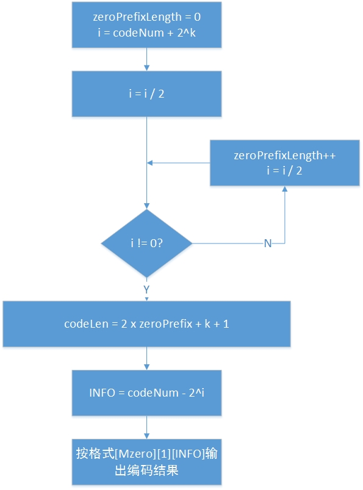

**哥伦布编码前言**
在计算机中，一般数字的编码都为二进制，但是由于以相等长度来记录不同数字，因此会出现很多的冗余信息，如下：

如数字1，原本只需要1个bit就能表示的数据，如今需要8个bit来表示，那么其余7个bit就可以看做是冗余数据，
在网络传输时，如果以原本等长的编码方式来传输数据，则会出现很大的冗余量，加重网络负担
但是如果只用有效字节来传输上述码流，则会是：10110011111111101，这样根本不能分离出原本的数据

哥伦布编码则是作为一种压缩编码算法，能很有效地对原本的数据进行压缩，并且能很容易地把编码后的码流分离成码字。

**哥伦布编码思想**
一个码字的信息量，称之为熵，二进制上可用log2[n]来表示，也就是上面表格的有效字节，但是如果只是把有效码字串联起来，得到的只是一串无用的码流，因为这串码流中并没有描述单一码字的信息量，也就是无法对码流进行分离
哥伦布编码就采用了加0前缀，用于表达码字的信息量，在得到m个0前缀后，就能知道该码字在码流中的长度，并从码流中把码字分离出来

**哥伦布编码概念**
指数哥伦布（Exp-Golomb）编码是一种在音视频编码标准中经常采用的可变长编码方法，它是使用一定规则构造码字的变长编码模式。它将所有数字分为等大小不同的组，符号值较小的组分配的码长较短，同一组内符号长基本相等，并且组的大小呈指数增长。
指数哥伦布码的比特串分为“前缀”（prefix）和“后缀”（suffix）两个部分。它的逻辑结构为：
**[Mzero][1][INFO]**
编码后码长为2M + 1 + k，M为前缀长度，1为中间的1长度，M+k为后缀长度

**哥伦布编码流程**
zeroPrefixLength用于存储0前缀个数
codeNum是即将被编码的码字
k是指数哥伦布编码的指数
codeLen用于存储编码后长度
INFO为哥伦布编码后缀

**编码时**
M = zeroPrefixLength = floor(log2[codeNum + 2^k])
INFO = codeNum + 1 - 2^M

可以对编码过程进行如下分析：
首先求出码字的信息量，为N，
由于信息量肯定大于1，为减小码流，对其减一得 M = N - 1(也就是上述的求下整)
然后也需要尽量对后缀进行压缩，因此利用前面所得的M进行缩减得，codeNum - 2^M
最后考虑到0这个数字的存在，为了使INFO非负，对其+1

**解码时**
codeNum = 2^M + INFO - 1
codeLen = 2M + 1 + k

**K阶指数哥伦布码表**

一般来说，根据码字出现的概率调整哥伦布编码的阶数K，
如果是码字0出现的概率较大，那么应该用K = 0，即0阶指数哥伦布编码
如果码字0与1出现的概率都比较大，那么应该用K = 1，以此类推
在H.264中用的是K = 0

JM代码如下
voidue_linfo(intue,intdummy,int*len,int*info)
{inti,nn;

  nn=(ue+1)/2;for(i=0; i <16&& nn !=0; i++)
  {
    nn/=2;
  }*len=2*i +1;//哥伦布码码字的长度*info=ue+1-(int)pow(2,i);//码字的内容}

