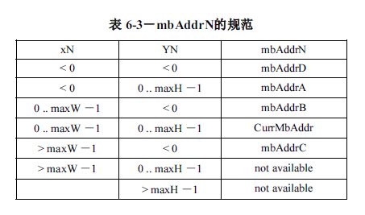
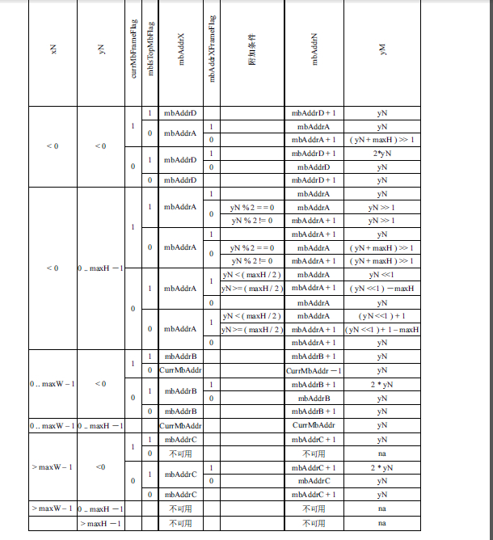
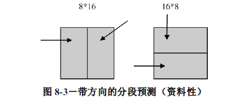
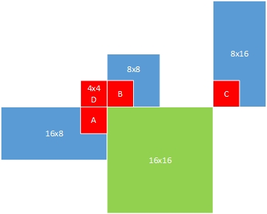

h.264标准中由于分为宏块分割块（8x8），子宏块分割块（4x4），所以各种各样的求解过程比较繁琐
下面整理出标准中mvp的求解过程

# 8.4.1.3
已知条件有当前块的属性：位置、块类型
需要得到当前块的mvp
已知条件（当前块位置，类型）
|
|8.4.1.3.2                         （步骤1）
|
得到相邻块(ABC（4x4）)的mv与refIdx
|
|8.4.1.3.1 或 8.4.1.3 后半段 （步骤2）
|
得到mvp

另外还需要注意的一点是，mvp是具有方向性的。意思是说在预测B slice的mvp时，需要分为前向mvp：mvL0；后向mvp：mvL1；他们分别对应的参考图像索引为refIdxL0与refIdxL1。也就是说，当在进行前向运动预测时，计算mvp阶段得到的是mvL0以及refIdxL0；当在进行后向运动预测时，计算mvp阶段得到的是mvL1以及refIdxL1。

# 8.4.1.3.2

1. 规定一个D块作为备用
2. 调用6.4.8.5得到ABC块位置

#### 6.4.8.5
子宏块分割块A,B,C中包含有以下像素点（xN,yN）
$\begin{align*}
xN &= x + xS + xD\\
yN &= y + yS + yD
\end{align*}$

* (x,y)为当前宏块分割块左上角点
* (xS,yS)为当前子宏块分割块左上角点
* (xD,yD)跟据A,B,C变化选择不同点
他们各自有以下特点

* (x,y)采用6.4.2.1的反向宏块分割块扫描
* (xS,yS)只有mb_type为P_8x8,P_8x8ref0,或者B_8x8时采用6.4.2.1的反向子宏块分割块扫描，否则为(0,0)
* (xD,yD)需要通过查表6-2得到，表当中有个变量predPartWidth
predPartWidth计算方式如下

* 当mb_type为P_Skip,B_Skip,B_Direct_16x16时，predPartWidth = 16
* 当mb_type为B_8x8,
* 当mb_type为P_8x8或P_8x8ref0，$predPartWidth = SubMbPartWidth( sub_mb_type[ mbPartIdx ] )$

* 否则 predPartWidth = MbPartWidth( mb_type )
得到（xN,yN）之后需要知道(xN,yN)所在的宏块mbAddrN以及其在宏块内的地址(xW,yW)，即从相对地址转换到绝对地址

#### 6.4.9
这一小节会通过(xN,yN)的相对地址得到它们的绝对地址。
首先需要知道宏块大小

* luma: maxW = maxH = 16
* chroma: maxW = MbWidthC maxH = MbHeightC
所在的宏块mbAddrN，根据MbaffFrameFlag不同，有不同求法

* 如果MbaffFrameFlag为0,    6.4.9.1
* 如果MbaffFrameFlag为1,    6.4.9.2

##### 6.4.9.1
表6-3得到mbAddrN

$\begin{align*}
xW &= ( xN + maxW )\ \%\ maxW\\
yW &= ( yN + maxH )\ \%\ maxH
\end{align*}$

##### 6.4.9.2
表6-4，即mbaff的情况，可以通过脑补获得，大概比B_Direct时容易

从mbAddrN得到该宏块是否可用
从（xW,yW）得到该子宏块分割块(4x4)位置，如果mbAddrN不可用则该4x4块不可用，如果该4x4块未解码那么也不可用

# ABC的运动矢量与参考索引处理
本小节的目的是得到得到A,B,C的参考图像索引refIdxLXN（refIdxLXA，refIdxLXB，refIdxLXC）以及运动矢量mvLXN（mvLXA，mvLXB，mvLXC）。不过由于我们已经得到了A、B、C块的位置，因此他们的这两个参数肯定是能获取得到的，除非出现以下的状况
首先，如果C不可用则用D来代替（4x4）
A，B，C的运动矢量mvLXN以及参考图像索引refIdxLXN在下面的情况下会进行特殊处理

* 某个N不可用
* 某个N为Intra编码
* 某个N的predFlagLX等于0（即该X方向不采用帧间预测编码）
则mvLXN的两个分量均置为0且refIdxLXN置为−1
（注：一般来说mv以4x4为单位,refIdx以8x8为单位）

进一步处理：

* 如果当前宏块为场宏块，且宏块mbAddrN为帧宏块，则$\begin{align*}mvLXN[ 1 ] &= mvLXN[ 1 ] / 2 \\
refIdxLXN &= refIdxLXN \times 2 \end{align*}$

* 否则，如果当前宏块为帧宏块且宏块mbAddrN为场宏块，那么$\begin{align*}mvLXN[ 1 ] &= mvLXN[ 1 ] \times 2 \\
refIdxLXN &= refIdxLXN / 2 \end{align*}$

* 否则，运动矢量垂直分量mvLXN[ 1 ]和参考索引refIdxLXN保持不变

# 8.4.1.3后半段
8*16以及16*8的情况，参照表8-3

# 8.4.1.3.1

* 如果B,C都不可用，用A代替
* 如果A,B,C中只有一个refIdxLX等于当前宏块分割块的refIdxLX（遍历得到的，即每个都会遍历到）,那么取该块的mv作为mvp
* 否则取中值（中位数）

至于JM，由于采用的是4x4块的计数方式，所以很容易就可以得到相邻块的位置，然后用所得相邻块mv与ref进行比较得到mvp

整个选取结果可参考下图：

* 蓝色为各个已选定用于编码的相邻块，
* 红色为4x4块，也就是蓝色块的一部分，当然包含蓝色块所含有的mv与refIdx
* 绿色为当前处理块，这里以16x16为例

得到（xN,yN）之后需要知道(xN,yN)所在的宏块mbAddrN以及其在宏块内的地址(xW,yW)
即从相对地址转换到绝对地址

