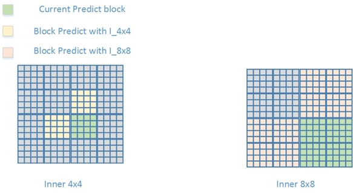
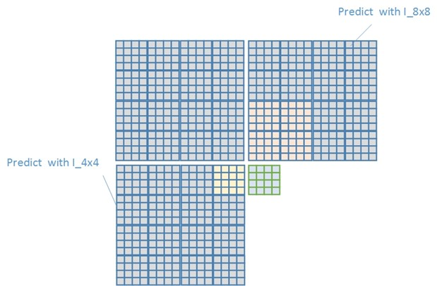
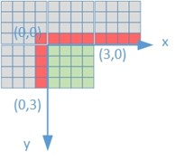
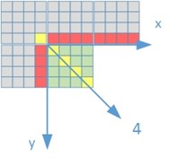
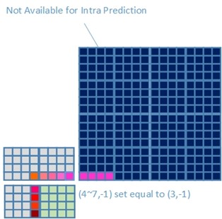
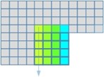
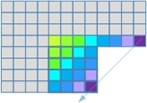
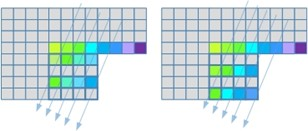
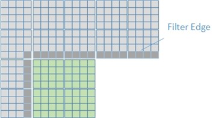

# 
在宏块的帧内预测过程中，有四种宏块类型：I_4x4，I_8x8，I16x16，I_PCM。他们都需要在相邻块做去块滤波之前进行帧内预测。

# 亮度帧内预测的总体流程
1-4获取当前block的帧内预测模式的预测，5-7获得最佳预测模式并对应预测模式的预测做后续处理

1. 首先需要获得当前4x4（8x8）预测块有左、上的4x4（8x8）相邻块A、B，假设其所在宏块为mbAddrA、mbAddrB。

2. 如果mbAddrA或mbAddrB中任意一个宏块不可用于帧内预测（[请参考](http://www.cnblogs.com/TaigaCon/p/4149938.html)），那么就会设置DC = 1，否则DC = 0。

3. 如果DC = 1，或者相邻宏块mbAddrA，mbAddrB不是以I_8x8或者I_4x4方式编码的，表明A、B不适用于当前的预测过程，那么设置A、B为PredModeA = PredModeB = 2。
否则DC = 0，并且mbAddrA与mbAddrB都是以I_8x8或者I_4x4方式编码的，则分别取得A与B的预测模式PredModeA, PredModeB。
预测模式的选取分为三种情况：

  1. 左与上的相邻块都在当前宏块，即此时当前宏块还未决定是采用I_8x8还是I_4x4或者其他的预测方式。那么当前块的相邻块A,B的预测模式就采用与这轮的宏块模式相同的方式的预测模式。如，当前正以I_8x8进行帧内预测，那PredModeA = PredMode8x8A，PredModeB = PredMode8x8_B.

  2. 左与上的宏块都位于相邻宏块，即当前块位于宏块的左上角。此时左与上块所在的宏块都已选定了所采用的帧内宏块预测方式，因此无论当前块是在哪轮的帧内预测上（I_4x4或I_8x8），都应采用相邻宏块的预测方式来作为当前块的相邻块的帧内预测模式，PredModeA = PredModeMacroBlockA，PredModeB = PredModeMacroBlockB.

  3. 左或上的其中一个块为相邻宏块，仅有一个（左或上）块位于当前宏块。这种情况下，位于其他宏块的相邻块采用其所在宏块的帧内预测模式，位于当前宏块的相邻块采用这一轮预测模式。PredModeA = PredMode4x4A，PredModeB = PredModeMacroblockB.

4. 根据相邻块的帧内预测模式得到当前预测模式的预测：
PredPredMode = Min(PredModeA, PredModeB)

5. 上面得到的只是一个预测值，并不是当前块实际的预测模式。因此还需要通过计算得到最适合当前块的预测模式PredMode

6. 如果PredPredMode == PredMode，说明上方的预测是准确的，设置PredModeFlag = 1;
否则PredModeFlag = 0。

7. I_4x4与I_8x8都有9个模式，但是在PredModeFlag = 0的时候，说明预测得到的预测模式PredPredMode可以被排除在外了，因此剩下的模式只有8个，这样刚刚好只用上3个bit就能表示。所以按照下方的做法，可以使原来4个bit才能表示的mode用3个bit就能表示：

  1. 如果PredMode < PredPredMode，remPredMode = PredMode

  2. 如果PredMode > PredPredMode，remPredMode = PredMode -1

remPredMode为最后用来编码的mode

现在所剩下的唯一疑点就是步骤5的：如何通过计算得当前块的最优预测模式。

预测模式一共有9种。他们的序号与名称见下方表格

可见4x4与8x8的预测模式都是以一样的顺序排列。
除了序号为2的DC模式外，其他模式都是通过相邻块的边缘像素点来进行线性预测的，预测方向如下

在图像上，像素点坐标是按照左上至右下的顺序递增的。按照这种规律，可以得到一个坐标轴如下

这样的话，预测模式就可以看做是斜率，只要知道坐标轴上的点（相邻块边界像素值），即可通过斜率（预测模式），得到该斜线上的坐标。

就以上图的这种情况为例，可以看到当mode=4时，斜率为1，即
$y=x+b$
$-b=x-y$
$-b$就是当$y=0$时，在x轴上的偏移，因此有
$p[-b,0]=p[x –y,0]$
由于同一条线上的值相等，所以有
$p[x,y]=p[x-y,0]$
同理，当$mode=5$时，斜率为2，有
$y=2\times{(x+b)}$
得到
$p[-b,0]=p[x-\frac{y}{2},0]=p[x,y]$

当然，以上只是大致阐述了用帧内预测来得到像素点的值的方式，在实际进行帧内预测的时候并不会这么简单，而且Intra4x4与Intra8x8在细节上也会有一些差别。下面会更详细地讨论Intra4x4预测模式。

# Intra4x4
对于一个4x4块来说，在进行帧内预测时会用到相邻像素点有13个，如上方图片中红色方块所示。但是在相邻宏块不可用于intra预测的时候，该相邻宏块上的像素点是不可用的，也就是说会存在相邻像素点不可用的情况。但是存在一个特殊情况：如果不可用的是（4~7，-1），而（3，-1）是可用的，那会令（4~7，-1）的值等于（3，-1）的像素点的值去进行预测。

1. Intra 4x4 Vertical Prediction Mode

$Pred{4}\times{4}_{L}[x,y] = p[x,-1]$

2. Intra 4x4 Horizontal Prediction mode

$Pred{4}\times{4}_{L}[x,y] = p[-1,y]$

3. Intra 4x4 DC Prediction Mode

  * If (0~3,-1) and (-1,0~3) is available for Intra 4x4 prediction$Pred{4}\times{4}_{L}[x,y] = \displaystyle{\sum_{y=0}^{3}{p[-1,y]} + \sum_{x=0}^{3}{p[x,-1]}}$

  * Else if only (0~3, -1) is available for Intra 4x4 prediction$Pred{4}\times{4}_{L}[x,y] = \displaystyle{\sum_{x=0}^{3}{p[x,-1]}}$

  * Else if only (-1, 0~3) is available for Intra 4x4 prediction$Pred{4}\times{4}_{L}[x,y] = \displaystyle{\sum_{y=0}^{3}{p[-1,y]}} $

  * Else none is available for Intra 4x4 prediction$Pred{4}\times{4}_{L}[x,y] = 1<<(BitDepth-1)$

4. Intra 4x4 Diagonal Down Left Prediction Mode

  * If $x = y = 3$$Pred{4}\times{4}_{L}[x,y] = (p[6,-1] + 3\times{p[7,-1]} + 2) >> 2$

  * Else$Pred{4}\times{4}_{L}[x,y] = (p[x + y,-1] + 2\times{p[x + y + 1,-1]} + p[x + y +2, -1] + 2) >> 2$

由上面的式子可以看出，在斜的方向上预测时，会参考不止一个相邻像素点，而是周围的两到三个。

5. Intra 4x4 Diagonal Down Right Prediction Mode

  * If $x > y$$Pred{4}\times{4}_{L}[x,y] = (p[x-y-2,-1] + 2\times{p[x-y-1,-1]} + p[x-y, -1] + 2) >> 2$

  * Else if $x < y$$Pred{4}\times{4}_{L}[x,y] = (p[-1,y-x-2] + 2\times{p[-1,y-x-1]} + p[-1,y-x] + 2) >> 2$

  * Else$Pred{4}\times{4}_{L}[x,y] = (p[0,-1] + 2\times{p[-1,-1]} + p[-1,0] +2)>>2$

6. Intra 4x4 Vertical Right Prediction Mode
$zVR = 2\times{x}+y$

  * If $zVR = 0,2,4,6$$Pred{4}\times{4}_{L}[x,y] = (p[x-\frac{y}{2}-1,-1] + p[x-\frac{y}{2}, -1] + 1) >> 1$

  * Else if $zVR = 1,3,5$$Pred{4}\times{4}_{L}[x,y] = (p[x-\frac{y}{2}-2,-1]+2\times{p[x-\frac{y}{2}-1,-1]} + p[x-\frac{y}{2}, -1] + 2) >> 2$

  * Else if $zVR = -1$$Pred{4}\times{4}_{L}[x,y] = (p[-1,0]+2\times{p[-1,-1]} + p[0, -1] + 2) >> 2$

  * Else $zVR = -2, -3$$Pred{4}\times{4}_{L}[x,y] = (p[-1,y-1]+2\times{p[-1,y-2]} + p[-1,y-3] + 2) >> 2$

7. Intra 4x4 Horizontal Down Prediction

$zHD = 2\times{y}-x$

  * If $zHD = 0,2,4,6$$Pred{4}\times{4}_{L}[x,y] = (p[-1,y-\frac{x}{2}-1] + p[-1,y-\frac{x}{2}] + 1) >> 1$

  * Else if $zHD = 1,3,5$$Pred{4}\times{4}_{L}[x,y] = (p[-1,y-\frac{x}{2}-2]+2\times{p[-1,y-\frac{x}{2}-1]} + p[-1,y-\frac{x}{2}] + 2) >> 2$

  * Else if $zHD = -1$$Pred{4}\times{4}_{L}[x,y] = (p[-1,0]+2\times{p[-1,-1]} + p[0, -1] + 2) >> 2$

  * Else $zHD = -2, -3$$Pred{4}\times{4}_{L}[x,y] = (p[x-1,-1]+2\times{p[x-2,-1]} + p[x-3,-1] + 2) >> 2$

8. Intra 4x4 Vertical Left Prediction Mode

  * If $y = 0,2$$Pred{4}\times{4}_{L}[x,y] = (p[x+\frac{y}{2},-1] + p[x+\frac{y}{2}+1,-1] + 1) >> 1$

  * Else $ y = 1,3$$Pred{4}\times{4}_{L}[x,y] = (p[x-1,-1]+2\times{p[x-2,-1]} + p[x-3,-1] + 2) >> 2$

9. Intra 4x4 Horizontal Up Predition

$zHU = x + 2\times{y}$

  * If $zHU = 0,2,4$$Pred{4}\times{4}_{L}[x,y] = (p[-1,y+\frac{x}{2}] + p[-1,y+\frac{x}{2}+1] + 1) >> 1$

  * Else if $zHU = 1,3$$Pred{4}\times{4}_{L}[x,y] = (p[-1,y+\frac{x}{2}]+2\times{p[-1,y+\frac{x}{2}+1]} + p[-1,y+\frac{x}{2}+2] + 2) >> 2$

  * Else if $zHU = 5$$Pred{4}\times{4}_{L}[x,y] = (p[-1,2]+3\times{p[-1,3]} + 2) >> 2$

  * Else $zHU > 5$$Pred{4}\times{4}_{L}[x,y] = p[-1,3]$

以上，可以看到Intra4x4预测的整个流程。在上面的图可以看到各个预测所需要的相邻像素点，如果该像素点不可用于Intra4x4的预测，那么依赖于该像素点的预测模式是不可用的。

# Intra8x8
8x8块的帧内预测跟4x4的基本上是一样的，可以看做放大了的4x4块。例如上面提到的相邻宏块不可用的情况，8x8块在预测时也会用(7,-1)去补全(8~15,-1)。而预测的方向也是与上面4x4预测的9个完全一样。
但是有一个不同的地方，就是8x8块在预测之前会去做一次边界像素点的滤波，滤波后所得的新像素点会被用于当前8x8块的预测，不同于4x4会直接去用边界像素点了进行预测。

# Intra16x16
Intra16x16是对整个宏块进行帧内预测，这种比4x4的更为简单，只有四种预测模式

其中模式0,1,2可以看做是Intra4x4模式的放大版，模式3可以参考[Chroma Intra Prediction的模式3](http://www.cnblogs.com/TaigaCon/p/4149938.html)。

# I_PCM
PCM模式就是把一个宏块共256个像素点的值不做任何处理，直接进行熵编码的模式，Chroma也有PCM这个模式。

