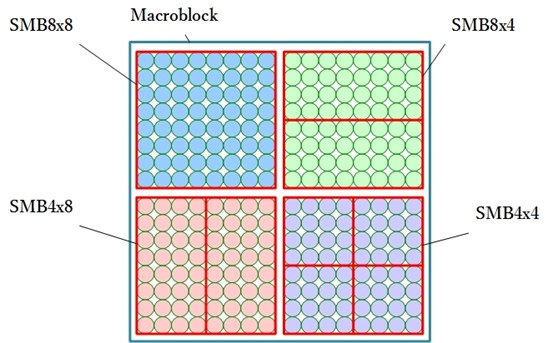
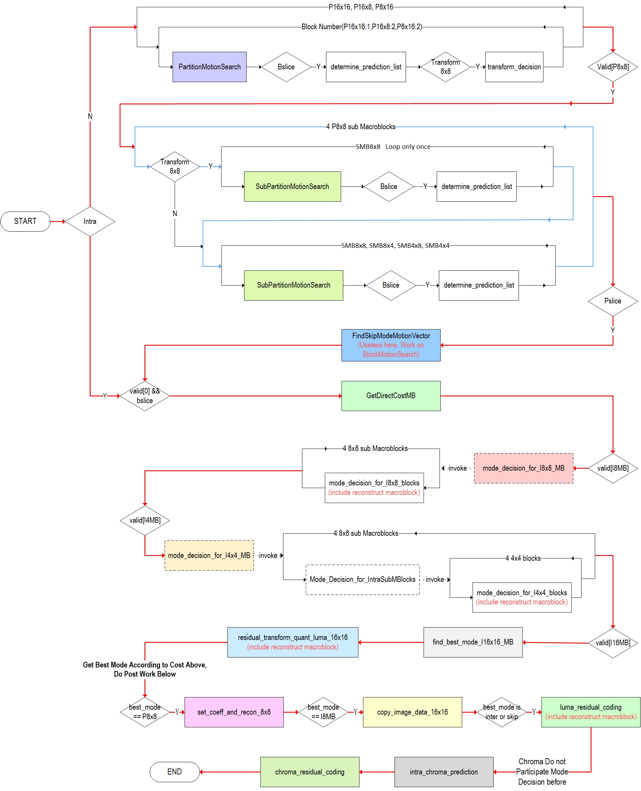
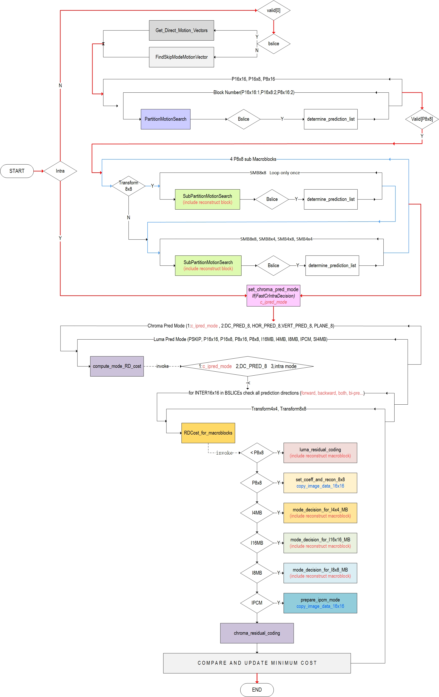
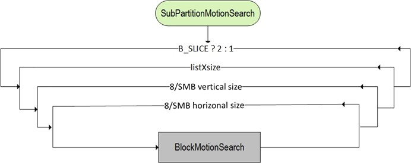

Mode Decision(模式选择)决定一个宏块以何种类型进行分割。宏块的分割类型有以下几种：
//P_Skip and B_Skip means that nothing need to be encoded for this macroblock ,
//    just use the mv predicted to restruct the macroblock
//B_Direct means use no mvd and no refidx, 
//    just use the mv abtain from Direct Algorithm and the residue mb 
//    base on such mv to restruct the macroblock.
//    On Direct mode, we need to encode redisual
enum {
  PSKIP        =  0,       //encode nothing
  BSKIP_DIRECT =  0,       //skip means encode nothing, direct means encode residual
  P16x16       =  1,       //16x16 on p or b slice
  P16x8        =  2,       //16x8 on p or b slice
  P8x16        =  3,       //8x16 on p or b slice
  SMB8x8       =  4,       //sub macroblock 8x8 on p or b slice
  SMB8x4       =  5,       //sub macroblock 8x4 on p or b slice
  SMB4x8       =  6,       //sub macroblock 4x8 on p or b slice
  SMB4x4       =  7,       //sub macroblock 4x4 on p or b slice
  P8x8         =  8,       //set of sub macroblock modes
  I4MB         =  9,       //4x4 on i slice
  I16MB        = 10,       //16x16 on i slice
  IBLOCK       = 11,       //the same with I4MB
  SI4MB        = 12,       //
  I8MB         = 13,       //8x8 on i slice
  IPCM         = 14,       //PCM mode
  MAXMODE      = 15
} MBModeTypes;

模式选择就是通过某种算法得到最优的宏块分割类型。不同算法在流程、最优分割方式选择上会有区别，但是都遵循h.264的标准。

# 宏块与子宏块
macroblock_layer( ) {
   mb_type
   if( mb_type  = =  I_PCM ) {   
       while( !byte_aligned( ) )   
            pcm_alignment_zero_bit
       for( i = 0; i < 256; i++ )   
            pcm_sample_luma[ i ]
       for( i = 0; i < 2 * MbWidthC * MbHeightC; i++ )   
            pcm_sample_chroma[ i ]
   } else {   
       noSubMbPartSizeLessThan8x8Flag = 1   
       if( mb_type  !=  I_NxN  && 
           MbPartPredMode( mb_type, 0 )  !=  Intra_16x16  && 
           NumMbPart( mb_type )  = =  4 ) { 
  
           sub_mb_pred( mb_type )       //子宏块预测
           for( mbPartIdx = 0; mbPartIdx < 4; mbPartIdx++ )   
                if( sub_mb_type[ mbPartIdx ]  !=  B_Direct_8x8 ) {   
                     if( NumSubMbPart( sub_mb_type[ mbPartIdx ] )  >  1 )   
                          noSubMbPartSizeLessThan8x8Flag = 0   
                     } else if( !direct_8x8_inference_flag )   
                         noSubMbPartSizeLessThan8x8Flag = 0   
       } else {   
            if( transform_8x8_mode_flag  &&  mb_type  = =  I_NxN )   
                transform_size_8x8_flag
            mb_pred( mb_type )          //宏块预测
       }   
       if( MbPartPredMode( mb_type, 0 )  !=  Intra_16x16 ) {   
            coded_block_pattern
            if( CodedBlockPatternLuma > 0  && 
                transform_8x8_mode_flag  &&  mb_type  !=  I_NxN  && 
                noSubMbPartSizeLessThan8x8Flag  && 
                ( mb_type  !=  B_Direct_16x16  | |  direct_8x8_inference_flag ) ) 
  
               transform_size_8x8_flag
       }   
       if( CodedBlockPatternLuma > 0  | |  CodedBlockPatternChroma > 0  | |             MbPartPredMode( mb_type, 0 )  = =  Intra_16x16 ) { 
  
             mb_qp_delta
             residual( )
       }   
    }   
}

上面是宏块层的语法，可以看到宏块预测可以分为两大类：宏块预测、子宏块预测，这两类预测是相互独立的。有兴趣可以去查看宏块结构（[h.264语法结构分析](http://www.cnblogs.com/TaigaCon/p/5215448.html)的slice_data之后的部分）、宏块与子宏块类型（[h.264宏块与子宏块类型](http://www.cnblogs.com/TaigaCon/p/5229392.html)）

子宏块类型则可以统一为一种类型P8x8，每个宏块有4个P8x8的子宏块，4个子宏块独立进行子宏块预测，每个子宏块都可以为不同的子宏块类型。

# Chroma模式选择
Chroma宏块只分为intra与inter两种类型，并不再细分。标准规定了Chroma宏块的预测方式是受到luma的预测方式的制约的。当luma是以intra进行预测时，chroma宏块才会进行intra预测；当luma是以inter进行预测时，chroma宏块进行的是inter预测（Chroma inter预测不会自行预测，而是通过luma预测结果进行缩放处理后得到的Chroma mv）。
宏块预测中，只有I4MB, I16MB, I8MB时Chroma宏块才会采用intra预测：
//只有当luma的预测模式为intra时，才会进行Chroma的intra预测
mb_pred( mb_type ) {
   if( MbPartPredMode( mb_type, 0 )  = =  Intra_4x4  | | 
        MbPartPredMode( mb_type, 0 )  = =  Intra_8x8  | | 
        MbPartPredMode( mb_type, 0 )  = =  Intra_16x16 ) { 
  
        if( MbPartPredMode( mb_type, 0 )  = =  Intra_4x4 )   
            for( luma4x4BlkIdx=0; luma4x4BlkIdx<16; luma4x4BlkIdx++ ) {   
                 prev_intra4x4_pred_mode_flag[ luma4x4BlkIdx ]
                 if( !prev_intra4x4_pred_mode_flag[ luma4x4BlkIdx ] )   
                     rem_intra4x4_pred_mode[ luma4x4BlkIdx ] 
            }   
        if( MbPartPredMode( mb_type, 0 )  = =  Intra_8x8 )   
            for( luma8x8BlkIdx=0; luma8x8BlkIdx<4; luma8x8BlkIdx++ ) {   
                 prev_intra8x8_pred_mode_flag[ luma8x8BlkIdx ]
                 if( !prev_intra8x8_pred_mode_flag[ luma8x8BlkIdx ] )   
                     rem_intra8x8_pred_mode[ luma8x8BlkIdx ]
            }   
         if( chroma_format_idc  !=  0 )   
           intra_chroma_pred_mode
   } else if( MbPartPredMode( mb_type, 0 )  !=  Direct ) {   
       for( mbPartIdx = 0; mbPartIdx < NumMbPart( mb_type ); mbPartIdx++)   
           if( ( num_ref_idx_l0_active_minus1 > 0  | | 
               mb_field_decoding_flag ) && 
          MbPartPredMode( mb_type, mbPartIdx )  !=  Pred_L1 ) 
  
               ref_idx_l0[ mbPartIdx ]
       for( mbPartIdx = 0; mbPartIdx < NumMbPart( mb_type ); mbPartIdx++)   
            if( ( num_ref_idx_l1_active_minus1  >  0  | | 
                     mb_field_decoding_flag ) && 
                 MbPartPredMode( mb_type, mbPartIdx )  !=  Pred_L0 ) 
  
                 ref_idx_l1[ mbPartIdx ]
       for( mbPartIdx = 0; mbPartIdx < NumMbPart( mb_type ); mbPartIdx++)   
           if( MbPartPredMode ( mb_type, mbPartIdx )  !=  Pred_L1 )   
                for( compIdx = 0; compIdx < 2; compIdx++ )   
                    mvd_l0[ mbPartIdx ][ 0 ][ compIdx ] 
       for( mbPartIdx = 0; mbPartIdx < NumMbPart( mb_type ); mbPartIdx++)   
            if( MbPartPredMode( mb_type, mbPartIdx )  !=  Pred_L0 )   
              for( compIdx = 0; compIdx < 2; compIdx++ )   
                  mvd_l1[ mbPartIdx ][ 0 ][ compIdx ]
   }   
}

子宏块预测中没有Chroma intra预测：
//可以看到子宏块预测时，没有Chroma的intra预测
sub_mb_pred( mb_type ) {
   for( mbPartIdx = 0; mbPartIdx < 4; mbPartIdx++ )     
        sub_mb_type[ mbPartIdx ]
   for( mbPartIdx = 0; mbPartIdx < 4; mbPartIdx++ )     
if( ( num_ref_idx_l0_active_minus1  >  0  | |  mb_field_decoding_flag ) && 
     mb_type  !=  P_8x8ref0  && 
     sub_mb_type[ mbPartIdx ]  !=  B_Direct_8x8  && 
     SubMbPredMode( sub_mb_type[ mbPartIdx ] )  !=  Pred_L1 ) 
  
            ref_idx_l0[ mbPartIdx ]
   for( mbPartIdx = 0; mbPartIdx < 4; mbPartIdx++ )     
if( (num_ref_idx_l1_active_minus1  >  0  | |  mb_field_decoding_flag ) && 
      sub_mb_type[ mbPartIdx ]  !=  B_Direct_8x8  && 
      SubMbPredMode( sub_mb_type[ mbPartIdx ] )  !=  Pred_L0 ) 
  
            ref_idx_l1[ mbPartIdx ]
   for( mbPartIdx = 0; mbPartIdx < 4; mbPartIdx++ )     
if( sub_mb_type[ mbPartIdx ]  !=  B_Direct_8x8  && 
     SubMbPredMode( sub_mb_type[ mbPartIdx ] )  !=  Pred_L1 ) 
  
for( subMbPartIdx = 0; 
       subMbPartIdx < NumSubMbPart( sub_mb_type[ mbPartIdx ] ); 
       subMbPartIdx++) 
  
                 for( compIdx = 0; compIdx < 2; compIdx++ )   
                      mvd_l0[ mbPartIdx ][ subMbPartIdx ][ compIdx ]
   for( mbPartIdx = 0; mbPartIdx < 4; mbPartIdx++ )   
        if( sub_mb_type[ mbPartIdx ]  !=  B_Direct_8x8  && 
             SubMbPredMode( sub_mb_type[ mbPartIdx ] )  !=  Pred_L0 ) 
  
for( subMbPartIdx = 0; 
       subMbPartIdx < NumSubMbPart( sub_mb_type[ mbPartIdx ] ); 
       subMbPartIdx++) 
  
                for( compIdx = 0; compIdx < 2; compIdx++ )   
                     mvd_l1[ mbPartIdx ][ subMbPartIdx ][ compIdx ]
}

# Mode Decision
JM18.6中有几种模式选择的算法，下面来分析一下low与high这两种算法的流程。

#### Mode Decision Low
该过程非常主要的一个特点是Chroma不参与模式选择

简述一下Low的流程：

1. inter的宏块类型（P16x16, P16x8, P8x16）选择。

2. inter的子宏块类型（SMB8x8, SMB8x4, SMB4x8, SMB4x4）选择，每个8x8都可以独立选择不同的分割方式；如果8x8变换方式可用的话，则会多进行一次只采用SMB8x8并采用8x8变换的编码方式，由此看出8x8变换在子宏块类型中只用于SMB8x8。

3. Skip, FindSkipModeMotionVector此处无作用。

4. Direct

5. I8MB,在4个8x8子宏块中可以分别选择不同的预测模式，该预测模式与I4MB一样有9种；在mode_decision_for_I8x8_blocks最后会进行残差编码，宏块重建。

6. I4MB,在16个4x4块中可以分别选择不同的预测模式，预测模式共9种；在mode_decision_for_I4x4_blocks最后会进行残差编码，宏块重建。

7. I16MB,在residual_transform_quant_luma_16x16最后会进行残差计算，宏块重建。

8. 上面的步骤已经通过rdcost选择到了最佳的宏块分割模式，这里会进行后续的参数设置，其中最主要的就是非intra模式的残差编码与宏块重建luma_residual_coding。

9. Chroma,可以注意到，在Low的流程中Chroma一直没有参与到模式选择当中。最后进行Chroma的intra预测，并根据前面luma所得的当前宏块为intra还是inter模式，选择相应的模式进行编码。

#### Mode Decision High
该过程中chroma宏块也参与模式选择。

简述一下high的流程：

1. SKIP, 如果是bslice调用Get_Direct_Motion_Vectors，pslice则调用FindSkipModeMotionVector获得运动向量。

2. inter的宏块类型（P16x16, P16x8, P8x16）选择。

3. inter的子宏块类型（SMB8x8, SMB8x4, SMB4x8, SMB4x4）选择，每个8x8都可以独立选择不同的分割方式；如果8x8变换方式可用的话，则会多进行一次只采用SMB8x8并采用8x8变换的编码方式，由此看出8x8变换在子宏块类型中只用于SMB8x8。

4. chroma预测模式，如果指定了FastCrIntraDecision，则挑选出最佳的chroma模式，否则得到的是chroma模式的范围（DC_PRED_8 ~ PLANE_8）。

5. 根据所得到的chroma模式范围进行循环。

6. 在所有luma 模式中选择最佳的模式。

7. compute_mode_RD_cost中首先筛选chroma模式，只有三种情况才可以往下选择最佳luma模式：
  * FastCrIntraDecision，表明只有一次chroma循环，并且循环前已经选出了最佳的chroma模式；
  * DC_PRED_8，chroma DC模式可以搭配所有的luma模式；
  * intra，luma intra模式可以搭配所有的chroma intra模式。

8. Bslice & P16x16的情况，再次(?)检查forward,backward,both,bi-pred中，哪种方式最佳。

9. 如果输入参数指定了transform 8x8，那么对transform8x8与transform4x4分别计算残差。

10. < P8x8,也就是P16x16, P16x8, P8x16的残差编码，宏块重建。

11. P8x8,也就是SMB8x8, SMB8x4, SMB4x8, SMB4x4宏块重建，他们的残差计算在子宏块预测时已经计算编码过，并且得到了子宏块的重建块，所以这里只是单纯把子宏块的重建块合并起来。

12. I4MB,在16个4x4块中可以分别选择不同的预测模式，预测模式共9种；在mode_decision_for_I4x4_blocks最后会进行残差编码，宏块重建。

13. I16MB,在residual_transform_quant_luma_16x16最后会进行残差编码，宏块重建。

14. I8MB,在4个8x8子宏块中可以分别选择不同的预测模式，该预测模式与I4MB一样有9种；在mode_decision_for_I8x8_blocks最后会进行残差编码，宏块重建。

15. IPCM，重建块就是编码块。

16. Chroma残差编码，其实函数内部分别包含了intra与inter的预测。只有luma在intra模式下，才能进行chroma的intra预测。最后进行chroma的残差编码，宏块重建。

17. 在每个luma模式最后，都计算出rdcost，然后与前面得到的最低rdcost比较，选择最佳的分割模式。

#### LOW与HIGH的共同点
可以看到他们在inter模式选择时流程大致一样的。先得到宏块的最佳分割模式，然后得到4个子宏块的最佳分割模式。下面大致浏览一下PartitionMotionSearch与SubPartitionMotionSearch的流程。

#### LOW与HIGH的不同点
不同点大致分为流程上，最优分割模式选择（计算rdcost）的差异。

* Low在对每种分割模式预测完后，立刻进行rdcost计算，用得到的rdcost对比前面已经得到的最佳cost，从而得到最佳模式。在得到最佳模式后，再进行残差编码与重建。
* High统一把对比cost并得到最佳模式这个过程写到compute_mode_RD_cost里面。在前面进行完成运动预测后，进入该函数对9种分割模式进行残差编码，宏块重建，cost计算与对比。其中4种intra分割模式是在这个函数内部才分别进行预测的。
* Low的rdcost计算并不像high的那么严谨，只是简单地算出distortion与残差系数以外的bit数。Low的rdcost不包括chroma所占用的bit。
* High的rdcost会计算经由熵编码后得到的bit，并且包含了chroma所占用的bit，因此更加精准。但是也会相应地增加编码时间。

#### 宏块重建
宏块重建是指把宏块反量化、反变换后得到的残差，加上参考帧中对应运动向量位置的宏块后重新构建当前宏块的过程。该过程一般处于反量化、反变换步骤之后，而反量化、反变换处于变换、量化这两个过程之后，即残差编码过程之内。因此，残差编码与宏块重建基本上都是一起进行的。
/*!
************************************************************************
* \brief
*    The routine performs transform,quantization,inverse transform, 
*    adds the diff to the prediction and writes the result to the 
*    decoded luma frame. 
*
* \par Input:
*    currMB:          Current macroblock.
*    pl:              Color plane for 4:4:4 coding.
*    block_x,block_y: Block position inside a macro block (0,4,8,12).
*    intra:           Intra block indicator.
*
* \par Output_
*    nonzero:         0 if no levels are nonzero. \n
*                     1 if there are nonzero levels.\n
*    coeff_cost:      Coeff coding cost for thresholding consideration.\n
************************************************************************
*/
int residual_transform_quant_luma_4x4(Macroblock *currMB, ColorPlane pl, int block_x,int block_y, int *coeff_cost, int intra)
{
  int nonzero = FALSE;

  int   pos_x   = block_x >> BLOCK_SHIFT;
  int   pos_y   = block_y >> BLOCK_SHIFT;
  int   b8      = 2*(pos_y >> 1) + (pos_x >> 1) + (pl<<2);
  int   b4      = 2*(pos_y & 0x01) + (pos_x & 0x01);
  Slice *currSlice = currMB->p_Slice;
  VideoParameters *p_Vid = currSlice->p_Vid;

  imgpel **img_enc = p_Vid->enc_picture->p_curr_img;
  imgpel **mb_pred = currSlice->mb_pred[pl];
  int    **mb_ores = currSlice->mb_ores[pl];  

  if (check_zero(&mb_ores[block_y], block_x) != 0) // check if any coefficients in block
  {
    int   **mb_rres = currSlice->mb_rres[pl];   
    int   max_imgpel_value = p_Vid->max_imgpel_value;
    int   qp = (p_Vid->yuv_format==YUV444 && !currSlice->P444_joined)? currMB->qp_scaled[(int)(p_Vid->colour_plane_id)]: currMB->qp_scaled[pl]; 
    QuantParameters   *p_Quant = p_Vid->p_Quant;
    QuantMethods quant_methods;
    quant_methods.ACLevel = currSlice->cofAC[b8][b4][0];
    quant_methods.ACRun   = currSlice->cofAC[b8][b4][1];

    //block_x,block_y here is the position of a block on a Macroblock with the unit of pixel
    quant_methods.block_x    = block_x;
    quant_methods.block_y    = block_y;
    quant_methods.qp         = qp;
    quant_methods.q_params   = p_Quant->q_params_4x4[pl][intra][qp]; 
    quant_methods.fadjust    = p_Vid->AdaptiveRounding ? (&p_Vid->ARCofAdj4x4[pl][currMB->ar_mode][block_y]) : NULL;
    quant_methods.coeff_cost = coeff_cost;
    quant_methods.pos_scan   = currMB->is_field_mode ? FIELD_SCAN : SNGL_SCAN;    
    quant_methods.c_cost     = COEFF_COST4x4[currSlice->disthres];

    currMB->subblock_x = ((b8&0x1)==0) ? (((b4&0x1)==0)? 0: 4) : (((b4&0x1)==0)? 8: 12); // horiz. position for coeff_count context
    currMB->subblock_y = (b8<2)        ? ((b4<2)       ? 0: 4) : ((b4<2)       ? 8: 12); // vert.  position for coeff_count context

    //  Forward 4x4 transform
    forward4x4(mb_ores, currSlice->tblk16x16, block_y, block_x);

    // Quantization process
    nonzero = currSlice->quant_4x4(currMB, &currSlice->tblk16x16[block_y], &quant_methods);

    //  Decoded block moved to frame memory
    if (nonzero)
    {
      // Inverse 4x4 transform
      inverse4x4(currSlice->tblk16x16, mb_rres, block_y, block_x);

      // generate final block
      sample_reconstruct (&img_enc[currMB->pix_y + block_y], &mb_pred[block_y], &mb_rres[block_y], block_x, currMB->pix_x + block_x, BLOCK_SIZE, BLOCK_SIZE, max_imgpel_value, DQ_BITS);
    }
    else // if (nonzero) => No transformed residual. Just use prediction.
    {
      copy_image_data_4x4(&img_enc[currMB->pix_y + block_y], &mb_pred[block_y], currMB->pix_x + block_x, block_x);
    }
  }
  else
  {
    currSlice->cofAC[b8][b4][0][0] = 0;
    copy_image_data_4x4(&img_enc[currMB->pix_y + block_y], &mb_pred[block_y], currMB->pix_x + block_x, block_x);
  }

  return nonzero;
}

