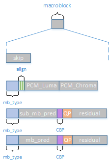
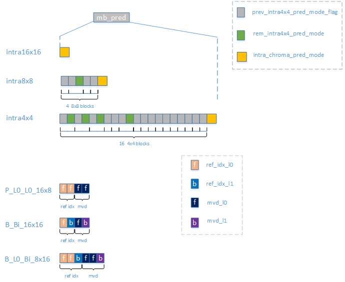
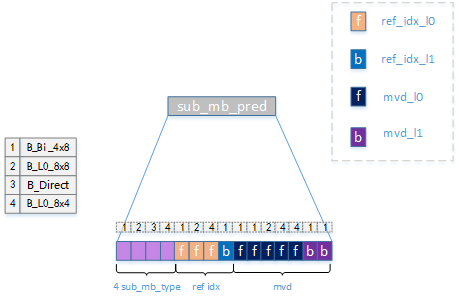
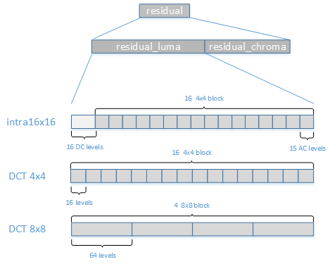

# NAL Unit Stream
Network Abstraction Layer，简称NAL。
h.264把原始的yuv文件编码成码流文件，生成的码流文件就是NAL单元流（NAL unit Stream）。而NAL单元流，就是NAL单元组成的。
标准的Annex B规定了NAL单元组成NAL单元流的方式，下面描述了如何将一个NAL单元打包起来，而多个NAL单元进行组合则形成了NAL单元流。
byte_stream_nal_unit( NumBytesInNALunit ) { C Descriptor
  while( next_bits( 24 ) != 0x000001 &&
    next_bits( 32 ) != 0x00000001 )
    leading_zero_8bits /* equal to 0x00 */ f(8)
  if( next_bits( 24 ) != 0x000001 )
    zero_byte /* equal to 0x00 */ f(8)
  start_code_prefix_one_3bytes /* equal to 0x000001 */ f(24)
  nal_unit( NumBytesInNALunit )
  while( more_data_in_byte_stream( ) &&
    next_bits( 24 ) != 0x000001 &&
    next_bits( 32 ) != 0x00000001 )
    trailing_zero_8bits /* equal to 0x00 */ f(8)
}
**语法元素**

* **leading_zero_8bits**0x00，只有可能出现在NAL单元流的头部，但是一般编码出来的h264文件都不会包含这部分。
* **zero_byte**0x00，如果当前的NAL单元为sps、pps或者一个访问单元（access unit）的第一个NAL单元，这个字节就会存在。访问单元代表一张编码图像，不包含sps、pps等外部数据，但是一幅编码图像有可能分成几个slice，甚至再细分成data partition，因此访问单元的第一个NAL单元就会是该图像的第一个slice或者slice data partition A。
* **start_code_prefix_one_3bytes**0x000001，固定存在的NAL单元起始码，用来指示下面为一个NAL单元。
* **nal_unit( NumBytesInNALunit )**NAL单元
* **trailing_zero_8bits**0x00，可能出现的NAL单元后的补零，但是一般编码出来的h264文件都没有包含这部分。

# NAL Unit
NAL单元是对RBSP进行打包生成的，NAL单元有如下语法
nal_unit( NumBytesInNALunit ) { C Descriptor
  forbidden_zero_bit All f(1)
  nal_ref_idc All u(2)
  nal_unit_type All u(5)
  NumBytesInRBSP = 0
  nalUnitHeaderBytes = 1
  if( nal_unit_type = = 14 | | nal_unit_type = = 20 | |
    nal_unit_type = = 21 ) {
    if( nal_unit_type ! = 21 )
      svc_extension_flag All u(1)
    else
      avc_3d_extension_flag All u(1)
    if( svc_extension_flag ) {
      nal_unit_header_svc_extension( ) /* specified in Annex G */ All
      nalUnitHeaderBytes += 3
    } else if( avc_3d_extension_flag ) {
      nal_unit_header_3davc_extension( ) /* specified in Annex J */
      nalUnitHeaderBytes += 2
    } else {
      nal_unit_header_mvc_extension( ) /* specified in Annex H */ All
      nalUnitHeaderBytes += 3
    }
  }
  for( i = nalUnitHeaderBytes; i < NumBytesInNALunit; i++ ) {
    if( i + 2 < NumBytesInNALunit && next_bits( 24 ) = = 0x000003 ) {
      rbsp_byte[ NumBytesInRBSP++ ] All b(8)
      rbsp_byte[ NumBytesInRBSP++ ] All b(8)
      i += 2
      emulation_prevention_three_byte /* equal to 0x03 */ All f(8)
    } else
      rbsp_byte[ NumBytesInRBSP++ ] All b(8)
  }
}

**语法元素**

* **forbidden_zero_bit**0，一个bit
* **nal_ref_idc**2个bit，用来指示当前NAL单元的优先级。0的优先级最低，如果当前NAL单元内是非参考图像的slice或者slice data partition等不是那么重要的数据，那么这个值为0；如果当前NAL单元内是sps、pps、参考图像的slice或者slice data partition等重要数据，那么这个值不为0
* **nal_unit_type**5个bit，用来指示当前NAL单元中包含的RBSP的结构，这些不同结构的RBSP由不同的RBSP语法生成，下一节我们将讨论这些RBSP语法。
* **svc_extension_flag**1个bit，Scalable Video Coding，主要分为Temporal，Spatial，Quality三种不同的scalable coding，分别对应同一码流内可以包含具有不同帧率、不同分辨率、不同码率的分层编码方式。特定的NAL type中才会出现这个位，这里不展开讨论
* **avc_3d_extension_flag**1个bit，表示3D编码，特定的NAL type中才会出现这个位，这里不作讨论
* **rbsp_byte**表示被打包的RBSP字节
* **emulation_prevention_three_byte**0x03，用于防止竞争。前面讨论过，NAL单元的头部会出现0x000001或者0x00000001的情况，那如果RBSP中也出现这几个字节就会把他们错当成NAL单元的头部了，为了防止这种情况，当RBSP中出现连续两个字节为零（即0x0000）时，会在后面插入一个0x03。则有
0x000000 =>  0x00000300
0x000001 =>  0x00000301
0x000002 =>  0x00000302
0x000003 =>  0x00000303
……

# RBSP
Raw Byte Sequence Payload，原始字节序列载荷。
跟据nal_unit_type可以分成以下表格

第一列代表当前NAL的类型；第二列是该类型对应的描述以及RBSP语法结构名称；第三列列出了当前NAL类型中可能出现的语法元素种类，（Category）种类在所有语法结构中的语法元素后面都有标明。

#### RBSP尾部
标准中描述了很多种的RBSP结构并且通过语法表现出来，RBSP语法主要规定了该结构由什么成员组成，各个成员如何组合，成员会占用几个bit。不过虽然RBSP结构有很多种，但是他们也有一个共同点：都有一个RBSP尾部。
RBSP尾部的语法如下：
rbsp_trailing_bits( ) { C Descriptor
  rbsp_stop_one_bit /* equal to 1 */ All f(1)
  while( !byte_aligned( ) )
    rbsp_alignment_zero_bit /* equal to 0 */ All f(1)
}
**语法元素**

* **rbsp_stop_one_bit**1位的1
* **rbsp_alignment_zero_bit**字节补零，目的是为了进行字节对齐

有一种特殊情况：如果采用的熵编码方式为CABAC，而且当前是实际图像内容相关的RBSP（名称包含slice的RBSP结构），那么会在RBSP尾部的后面添加1个或多个0x0000。语法表示如下：
rbsp_slice_trailing_bits( ) { C Descriptor
  rbsp_trailing_bits( ) All
  if( entropy_coding_mode_flag )
    while( more_rbsp_trailing_data( ) )
      cabac_zero_word /* equal to 0x0000 */ All f(16)
}
**语法元素**

* **cabac_zero_word**0x0000

RBSP中除了rbsp_trailing_bits以及rbsp_slice_trailing_bits，其余部分被统称为SODB（String Of Data Bits）。

#### seq_parameter_set_rbsp
这是SPS RBSP的名称，它的结构如下
seq_parameter_set_rbsp( ) { C Descriptor
  seq_parameter_set_data( ) 0
  rbsp_trailing_bits( ) 0
}
如前面所说，RBSP都有一个rbsp_trailing_bits的尾部。而SPS的结构被包含在了seq_parameter_set_data里面
seq_parameter_set_data( ) { C Descriptor
  profile_idc 0 u(8)
  constraint_set0_flag 0 u(1)
  constraint_set1_flag 0 u(1)
  constraint_set2_flag 0 u(1)
  constraint_set3_flag 0 u(1)
  constraint_set4_flag 0 u(1)
  constraint_set5_flag 0 u(1)
  reserved_zero_2bits /* equal to 0 */ 0 u(2)
  level_idc 0 u(8)
  seq_parameter_set_id 0 ue(v)
  if( profile_idc = = 100 | | profile_idc = = 110 | | 
    profile_idc = = 122 | | profile_idc = = 244 | | profile_idc = = 44 | |
    profile_idc = = 83 | | profile_idc = = 86 | | profile_idc = = 118 | |
    profile_idc = = 128 | | profile_idc = = 138 | | profile_idc = = 139 | |
    profile_idc = = 134 ) {
    chroma_format_idc 0 ue(v)
    if( chroma_format_idc = = 3 )
      separate_colour_plane_flag 0 u(1)
    bit_depth_luma_minus8 0 ue(v)
    bit_depth_chroma_minus8 0 ue(v)
    qpprime_y_zero_transform_bypass_flag 0 u(1)
    seq_scaling_matrix_present_flag 0 u(1)
    if( seq_scaling_matrix_present_flag )
      for( i = 0; i < ( ( chroma_format_idc != 3 ) ? 8 : 12 ); i++ ) {
        seq_scaling_list_present_flag[ i ] 0 u(1)
        if( seq_scaling_list_present_flag[ i ] )
        if( i < 6 )
          scaling_list( ScalingList4x4[ i ], 16,
          UseDefaultScalingMatrix4x4Flag[ i ]) 0
        else
          scaling_list( ScalingList8x8[ i − 6 ], 64,
          UseDefaultScalingMatrix8x8Flag[ i − 6 ] ) 0
      }
  }
  log2_max_frame_num_minus4 0 ue(v)
  pic_order_cnt_type 0 ue(v)
  if( pic_order_cnt_type = = 0 )
    log2_max_pic_order_cnt_lsb_minus4 0 ue(v)
  else if( pic_order_cnt_type = = 1 ) {
    delta_pic_order_always_zero_flag 0 u(1)
    offset_for_non_ref_pic 0 se(v)
    offset_for_top_to_bottom_field 0 se(v)
    num_ref_frames_in_pic_order_cnt_cycle 0 ue(v)
    for( i = 0; i < num_ref_frames_in_pic_order_cnt_cycle; i++ )
      offset_for_ref_frame[ i ] 0 se(v)
  }
  max_num_ref_frames
  gaps_in_frame_num_value_allowed_flag 0 u(1)
  pic_width_in_mbs_minus1 0 ue(v)
  pic_height_in_map_units_minus1 0 ue(v)
  frame_mbs_only_flag 0 u(1)
  if( !frame_mbs_only_flag )
    mb_adaptive_frame_field_flag 0 u(1)
  direct_8x8_inference_flag 0 u(1)
  frame_cropping_flag 0 u(1)
  if( frame_cropping_flag ) {
    frame_crop_left_offset 0 ue(v)
    frame_crop_right_offset 0 ue(v)
    frame_crop_top_offset 0 ue(v)
    frame_crop_bottom_offset 0 ue(v)
  }
  vui_parameters_present_flag 0 u(1)
  if( vui_parameters_present_flag )
    vui_parameters( ) 0
}

**语法元素**

* **profile_idc**本视频编码时遵循的profile，profile分为Baseline，Main，Extended等，主要用来规定编码时是否采用某些特性，比如说Baseline profile就规定了只能使用I、P slice进行编码，关于profile的说明可以去查看标准的Annex A。
* **constraint_set0_flag**强制使用Baseline profile进行编码
* **constraint_set1_flag**强制使用Main profile进行编码
* **constraint_set2_flag**强制使用Extended profile进行编码
* …
* **reserved_zero_2bits**两个0bit的保留位
* **level_idc**本视频遵循的level，level主要规定了每秒最多能处理多少个宏块，最大的帧大小，最大的解码缓存，最大比特率等这些性能相关的东西，如果是硬解码，则比较容易出现由于视频level太高而不能解码的情况。
* **seq_parameter_set_id**本SPS的ID，这个ID主要是给PPS用的。
* **log2_max_frame_num_minus4**
* **pic_order_cnt_type**
* **log2_max_pic_order_cnt_lsb_minus4**
* **delta_pic_order_always_zero_flag**
* **offset_for_non_ref_pic**
* **offset_for_top_to_bottom_field**
* **num_ref_frames_in_pic_order_cnt_cycle**
* **offset_for_ref_frame**以上这几个参数的目的都是进行POC计算，请参考[h.264的POC计算](http://www.cnblogs.com/TaigaCon/p/3551001.html)
* **max_num_ref_frames**参考帧最多能有多少个
* **gaps_in_frame_num_value_allowed_flag**由于码流在传输过程中可能出现丢包的情况，从而导致中间有帧缺失，如果制定了这个标记，则会在解码时对帧丢失的情况进行调整，否则就当作意外丢失处理。
* **pic_width_in_mbs_minus1**图片宽度（宏块为单位）-1
* **pic_height_in_map_units_minus1**图片高度（宏块为单位）-1
* **frame_mbs_only_flag**是否只进行帧编码
* **mb_adaptive_frame_field_flag**是否进行帧场自适应编码
* **direct_8x8_inference_flag**在进行B Direct预测时，是否子宏块（8x8块）中的4个4x4块共用一个4x4的co-located，请参考[h.264直接预测](http://www.cnblogs.com/TaigaCon/p/3677540.html)中的direct_8x8_inference_flag关键字
* **frame_cropping_flag**是否需要对解码后的图片进行修剪
* **frame_crop_left_offset**
* **frame_crop_right_offset**
* **frame_crop_top_offset**
* **frame_crop_bottom_offset**分别指示修剪的左右上下
* **vui_parameters_present_flag**SPS是否包含vui参数
* **vui_parameters**video usability information，在标准的Annex E中有描述，主要包含了视频的比例调整，overscan，视频格式，timing，比特率等信息。

#### pic_parameter_set_rbsp
如前面所说，RBSP都有一个rbsp_trailing_bits的尾部。PPS RBSP结构如下
pic_parameter_set_rbsp( ) { C Descriptor
  pic_parameter_set_id 1 ue(v)
  seq_parameter_set_id 1 ue(v)
  entropy_coding_mode_flag 1 u(1)
  bottom_field_pic_order_in_frame_present_flag 1 u(1)
  num_slice_groups_minus1 1 ue(v)
  if( num_slice_groups_minus1 > 0 ) {
    slice_group_map_type 1 ue(v)
    if( slice_group_map_type = = 0 )
      for( iGroup = 0; iGroup <= num_slice_groups_minus1; iGroup++ )
        run_length_minus1[ iGroup ] 1 ue(v)
    else if( slice_group_map_type = = 2 )
      for( iGroup = 0; iGroup < num_slice_groups_minus1; iGroup++ ) {
        top_left[ iGroup ] 1 ue(v)
        bottom_right[ iGroup ] 1 ue(v)
      }
    else if( slice_group_map_type = = 3 | |
      slice_group_map_type = = 4 | |
      slice_group_map_type = = 5 ) {
      slice_group_change_direction_flag 1 u(1)
      slice_group_change_rate_minus1 1 ue(v)
    } else if( slice_group_map_type = = 6 ) {
      pic_size_in_map_units_minus1 1 ue(v)
      for( i = 0; i <= pic_size_in_map_units_minus1; i++ )
        slice_group_id[ i ] 1 u(v)
    }
  }
  num_ref_idx_l0_default_active_minus1 1 ue(v)
  num_ref_idx_l1_default_active_minus1 1 ue(v)
  weighted_pred_flag 1 u(1)
  weighted_bipred_idc 1 u(2)
  pic_init_qp_minus26 /* relative to 26 */ 1 se(v)
  pic_init_qs_minus26 /* relative to 26 */ 1 se(v)
  chroma_qp_index_offset 1 se(v)
  deblocking_filter_control_present_flag 1 u(1)
  constrained_intra_pred_flag 1 u(1)
  redundant_pic_cnt_present_flag 1 u(1)
  if( more_rbsp_data( ) ) {
    transform_8x8_mode_flag 1 u(1)
    pic_scaling_matrix_present_flag 1 u(1)
    if( pic_scaling_matrix_present_flag )
      for( i = 0; i < 6 +
        ( ( chroma_format_idc != 3 ) ? 2 : 6 ) * transform_8x8_mode_flag;
        i++ ) {
        pic_scaling_list_present_flag[ i ] 1 u(1)
        if( pic_scaling_list_present_flag[ i ] )
          if( i < 6 )
            scaling_list( ScalingList4x4[ i ], 16,
            UseDefaultScalingMatrix4x4Flag[ i ] ) 1
          else
            scaling_list( ScalingList8x8[ i − 6 ], 64,
            UseDefaultScalingMatrix8x8Flag[ i − 6 ] ) 1
      }
    second_chroma_qp_index_offset 1 se(v)
  }
  rbsp_trailing_bits( ) 1
}

**语法元素**

* **pic_parameter_set_id**当前PPS的ID，供slice RBSP使用
* **seq_parameter_set_id**当前PPS所属的SPS的ID
* **entropy_coding_mode_flag**为0时表明采用CAVLC编码，为1时采用CABAC编码
* **bottom_field_pic_order_in_frame_present_flag**用于POC计算，请参考[h.264的POC计算](http://www.cnblogs.com/TaigaCon/p/3551001.html)中的bottom_field_flag
* **num_slice_groups_minus1**进行图像编码时，分成几个slice group，关于slice group请参考[h.264 FMO](http://www.cnblogs.com/TaigaCon/p/3605762.html)
* **slice_group_map_type**如果num_slice_groups_minus1>0表明会分成多个slice group，此时会采用slice_group_map_type来规定宏块的组合方式，这部分请参考[h.264 FMO](http://www.cnblogs.com/TaigaCon/p/3605762.html)
* **num_ref_idx_l0_default_active_minus1**
* **num_ref_idx_l1_default_active_minus1**分别指示前向参考图像以及后向参考图像的个数，请参考[h.264参考图像列表、解码图像缓存](http://www.cnblogs.com/TaigaCon/p/3715276.html)->参考图像列表->长度
* **weighted_pred_flag**用于指示P，SP slice是否进行亮度的加权预测，请参考[h.264加权预测](http://www.cnblogs.com/TaigaCon/p/3602548.html)
* **weighted_bipred_idc**用于指示B slice的加权预测，0：否  1：显式加权预测  2：隐式加权预测，请参考[h.264加权预测](http://www.cnblogs.com/TaigaCon/p/3602548.html)
* **pic_init_qp_minus26**用于计算初始QP（整个视频QP的基准值），关于QP，请参考[H.264 Quantization](http://www.cnblogs.com/TaigaCon/p/4266686.html)
* **pic_init_qs_minus26**用于计算SP，SI帧的初始QP
* **chroma_qp_index_offset**色度宏块Cb与亮度宏块Y的QP差值
* **deblocking_filter_control_present_flag**是否进行[deblocking](https://www.cnblogs.com/TaigaCon/p/5500110.html)
* **constrained_intra_pred_flag**0：当宏块进行intra编码时，尽管周边宏块为inter编码，也能用于当前宏块的intra预测。1：当宏块进行intra编码时，只有为intra编码的周边宏块才能用于当前宏块的intra预测，请参考[Intra Luma Prediction](http://www.cnblogs.com/TaigaCon/p/4190806.html)
* **redundant_pic_cnt_present_flag**如果当前视频中冗余图像的话（SI，SP），那么这个flag应该为1
* **transform_8x8_mode_flag**用于指示luma宏块是否以8x8的方式进行DCT变换
  * 1：当前luma宏块进行8x8 DCT
  * 0：当前luma宏块进行4x4 DCT
这个标记不会作用到chroma宏块，除非序列格式为4:4:4。也就是说如果序列格式为4:2:0或者4:2:2，那么无论transform_8x8_mode_flag是什么，chroma宏块都是采用4x4 DCT。而如果序列格式为4:4:4，chroma宏块采用与luma宏块相同的DCT。如果码流中没有出现这个标记，那么这个标记的值默认为0。

* **pic_scaling_matrix_present_flag**scaling list相关
* **second_chroma_qp_index_offset**色度宏块Cr与亮度宏块Y的QP差值

#### slice_layer_without_partitioning_rbsp
如果当前slice不采用slice data partition的RBSP结构的话，就会是这个RBSP结构，编码时一般都会采用的这个RBSP结构。
我们知道编码是以slice为单位的，这个结构内包含的就是视频中编码的主要内容，视频图像进行编码后就会包含在这个结构内，也就是说编码后的码流中，大多数都是以这个结构的RBSP打包成的NAL unit。
语法结构如下
slice_layer_without_partitioning_rbsp( ) { C Descriptor
  slice_header( ) 2
  slice_data( ) /* all categories of slice_data( ) syntax */ 2 | 3 | 4
  rbsp_slice_trailing_bits( ) 2
}
其中分成slice_header，slice_data两部分，最后是RBSP尾部。

##### **slice_header**
slice_header就是slice的头部，其中包含的是本slice的相关参数，语法结构如下
slice_header( ) { C Descriptor
  first_mb_in_slice 2 ue(v)
  slice_type 2 ue(v)
  pic_parameter_set_id 2 ue(v)
  if( separate_colour_plane_flag = = 1 )
    colour_plane_id 2 u(2)
  frame_num 2 u(v)
  if( !frame_mbs_only_flag ) {
    field_pic_flag 2 u(1)
    if( field_pic_flag )
      bottom_field_flag 2 u(1)
  }
  if( IdrPicFlag )
    idr_pic_id 2 ue(v)
  if( pic_order_cnt_type = = 0 ) {
    pic_order_cnt_lsb 2 u(v)
    if( bottom_field_pic_order_in_frame_present_flag && !field_pic_flag )
      delta_pic_order_cnt_bottom 2 se(v)
  }
  if( pic_order_cnt_type = = 1 && !delta_pic_order_always_zero_flag ) {
    delta_pic_order_cnt[ 0 ] 2 se(v)
    if( bottom_field_pic_order_in_frame_present_flag && !field_pic_flag )
      delta_pic_order_cnt[ 1 ] 2 se(v)
  }
  if( redundant_pic_cnt_present_flag )
    redundant_pic_cnt 2 ue(v)
  if( slice_type = = B )
    direct_spatial_mv_pred_flag 2 u(1)
  if( slice_type = = P | | slice_type = = SP | | slice_type = = B ) {
    num_ref_idx_active_override_flag 2 u(1)
    if( num_ref_idx_active_override_flag ) {
      num_ref_idx_l0_active_minus1 2 ue(v)
      if( slice_type = = B )
        num_ref_idx_l1_active_minus1 2 ue(v)
    }
  }
  if( nal_unit_type = = 20 | | nal_unit_type = = 21 )
    ref_pic_list_mvc_modification( ) /* specified in Annex H */ 2
  else
    ref_pic_list_modification( ) 2
  if( ( weighted_pred_flag && ( slice_type = = P | | slice_type = = SP ) ) | |
    ( weighted_bipred_idc = = 1 && slice_type = = B ) )
    pred_weight_table( ) 2
  if( nal_ref_idc != 0 )
    dec_ref_pic_marking( ) 2
  if( entropy_coding_mode_flag && slice_type != I && slice_type != SI )
    cabac_init_idc 2 ue(v)
  slice_qp_delta 2 se(v)
  if( slice_type = = SP | | slice_type = = SI ) {
    if( slice_type = = SP )
      sp_for_switch_flag 2 u(1)
    slice_qs_delta 2 se(v)
  }
  if( deblocking_filter_control_present_flag ) {
    disable_deblocking_filter_idc 2 ue(v)
    if( disable_deblocking_filter_idc != 1 ) {
      slice_alpha_c0_offset_div2 2 se(v)
      slice_beta_offset_div2 2 se(v)
    }
  }
  if( num_slice_groups_minus1 > 0 &&
    slice_group_map_type >= 3 && slice_group_map_type <= 5)
    slice_group_change_cycle 2 u(v)
}

**语法元素**

* **first_mb_in_slice**当前slice的第一个宏块在图像中的位置
* **slice_type**指示当前slice的类型，如下表。当slice_type为5~9的时候，就表明要求当前图像的其他slice为slice_type%5，也就是要求当前图像slice_type一致

* **pic_parameter_set_id**当前slice所属的PPS的ID
* **frame_num**用于POC计算，请参考[h.264的POC计算](http://www.cnblogs.com/TaigaCon/p/3551001.html)中的frame_num
* **field_pic_flag**当前slice是否进行的是场编码
* **bottom_field_flag**当前slice是否在底场（bottom field）
* **idr_pic_id**指示IDR图片的ID
* **pic_order_cnt_lsb**
* **delta_pic_order_cnt_bottom**
* **delta_pic_order_cnt**以上三个都是用于计算POC，请参考[h.264的POC计算](http://www.cnblogs.com/TaigaCon/p/3551001.html)
* **redundant_pic_cnt**冗余图像编码相关
* **direct_spatial_mv_pred_flag**1：B帧direct编码采用空域预测方式，0：B帧direct编码采用时域预测方式，请参考[h.264直接预测](http://www.cnblogs.com/TaigaCon/p/3677540.html)
* **num_ref_idx_active_override_flag**当前slice的参考图像列表是否采用以下两个长度而不用PPS规定的长度
* **num_ref_idx_l0_active_minus1**前向参考图像列表长度
* **num_ref_idx_l1_active_minus1**后续参考图像列表长度
* **ref_pic_list_modification**参考图像列表重排序的参数结构语法，请结合标准并参考[h.264参考图像列表、解码图像缓存](http://www.cnblogs.com/TaigaCon/p/3715276.html)->参考图像列表->参考图像列表重排序
* **pred_weight_table**加权预测的参数结构语法，请结合标准并参考[h.264加权预测](http://www.cnblogs.com/TaigaCon/p/3602548.html)
* **dec_ref_pic_marking**解码图像标记的参数结构语法，请结合标准并参考[h.264参考图像列表、解码图像缓存](http://www.cnblogs.com/TaigaCon/p/3715276.html)->解码图像缓存->解码图像标记过程
* **cabac_init_idc**cabac中m、n表的索引
* **slice_qp_delta**pic_init_qp_minus26 + 26 + slice_qp_delta将成为当前slice的初始QP
* **disable_deblocking_filter_idc**
* **slice_alpha_c0_offset_div2**
* **slice_beta_offset_div2**以上三个是[deblocking](https://www.cnblogs.com/TaigaCon/p/5500110.html)的相关参数

##### **slice_data**
slice_data是slice的主体部分，当前slice内的宏块编码后的信息都在其中。
语法结构如下
slice_data( ) { C Descriptor
  if( entropy_coding_mode_flag )
    while( !byte_aligned( ) )
      cabac_alignment_one_bit 2 f(1)
  CurrMbAddr = first_mb_in_slice * ( 1 + MbaffFrameFlag )
  moreDataFlag = 1
  prevMbSkipped = 0
  do {
    if( slice_type != I && slice_type != SI )
      if( !entropy_coding_mode_flag ) {
        mb_skip_run 2 ue(v)
        prevMbSkipped = ( mb_skip_run > 0 )
        for( i=0; i<mb_skip_run; i++ )
        CurrMbAddr = NextMbAddress( CurrMbAddr )
        if( mb_skip_run > 0 )
        moreDataFlag = more_rbsp_data( )
      } else {
        mb_skip_flag 2 ae(v)
        moreDataFlag = !mb_skip_flag
      }
    if( moreDataFlag ) {
      if( MbaffFrameFlag && ( CurrMbAddr % 2 = = 0 | |
      ( CurrMbAddr % 2 = = 1 && prevMbSkipped ) ) )
        mb_field_decoding_flag 2 u(1) | ae(v)
      macroblock_layer( ) 2 | 3 | 4
    }
    if( !entropy_coding_mode_flag )
      moreDataFlag = more_rbsp_data( )
    else {
      if( slice_type != I && slice_type != SI )
        prevMbSkipped = mb_skip_flag
      if( MbaffFrameFlag && CurrMbAddr % 2 = = 0 )
        moreDataFlag = 1
      else {
        end_of_slice_flag 2 ae(v)
        moreDataFlag = !end_of_slice_flag
      }
    }
    CurrMbAddr = NextMbAddress( CurrMbAddr )
  } while( moreDataFlag )
}

**可以注意到slice_data内头部的对齐外，它由宏块信息循环组合而成。**

**语法元素**

* **cabac_alignment_one_bit**如果是cabac，需要slice_data的头部8bit对齐，因此可能需要插入1
* **mb_skip_run**如果当前采用的是CAVLC编码方式，则会采用这个语法元素来表达skip宏块（P_Skip，B_Skip），mb_skip_run代表的是当前这个宏块以及它的后面共有多少个跳过宏块，并且后面的skip宏块都不会被编码。
* **mb_skip_flag**如果当前采用的是CABAC编码方式，则会采用这个语法元素来表达skip宏块（P_Skip，B_Skip），跟mb_skip_run不同的是，每个skip宏块都有一个mb_skip_flag
* **macroblock_layer**如果不是为skip宏块的话，则表明本宏块有编码的数据，因此会进去macroblock_layer
* **end_of_slice_flag**如果采用的是CABAC编码方式，还会用这个标记来表达当前宏块是否为这个slice的最后一个宏块

##### **macroblock_layer**
如前面所说，这里面的是宏块编码数据，语法结构如下
macroblock_layer( ) { C Descriptor
  mb_type 2 ue(v) | ae(v)
  if( mb_type = = I_PCM ) {
    while( !byte_aligned( ) )
      pcm_alignment_zero_bit 3 f(1)
    for( i = 0; i < 256; i++ )
      pcm_sample_luma[ i ] 3 u(v)
    for( i = 0; i < 2 * MbWidthC * MbHeightC; i++ )
      pcm_sample_chroma[ i ] 3 u(v)
  } else {
    noSubMbPartSizeLessThan8x8Flag = 1
    if( mb_type != I_NxN &&
      MbPartPredMode( mb_type, 0 ) != Intra_16x16 &&
      NumMbPart( mb_type ) = = 4 ) {
      sub_mb_pred( mb_type ) 2
      for( mbPartIdx = 0; mbPartIdx < 4; mbPartIdx++ )
        if( sub_mb_type[ mbPartIdx ] != B_Direct_8x8 ) {
          if( NumSubMbPart( sub_mb_type[ mbPartIdx ] ) > 1 )
            noSubMbPartSizeLessThan8x8Flag = 0
        } else if( !direct_8x8_inference_flag )
          noSubMbPartSizeLessThan8x8Flag = 0
    } else {
      if( transform_8x8_mode_flag && mb_type = = I_NxN )
        transform_size_8x8_flag 2 u(1) | ae(v)
      mb_pred( mb_type ) 2
    }
    if( MbPartPredMode( mb_type, 0 ) != Intra_16x16 ) {
      coded_block_pattern 2 me(v) | ae(v)
      if( CodedBlockPatternLuma > 0 &&
      transform_8x8_mode_flag && mb_type != I_NxN &&
      noSubMbPartSizeLessThan8x8Flag &&
      ( mb_type != B_Direct_16x16 | | direct_8x8_inference_flag ) )
      transform_size_8x8_flag 2 u(1) | ae(v)
    }
    if( CodedBlockPatternLuma > 0 | | CodedBlockPatternChroma > 0 | |
      MbPartPredMode( mb_type, 0 ) = = Intra_16x16 ) {
      mb_qp_delta 2 se(v) | ae(v)
      residual( 0, 15 ) 3 | 4
    }
  }
}

**语法元素**

* **mb_type**当前宏块的类型，对于不同的slice（I,P,B），同一个值会表示不同的类型。而且这个类型不仅仅表达宏块的预测模式，分割方式，还有其他的一些信息，请参考[h.264宏块与子宏块类型](http://www.cnblogs.com/TaigaCon/p/5229392.html)
* **pcm_alignment_zero_bit**在PCM情况下会要求进行字节对齐
* **pcm_sample_luma**亮度的PCM，一共有16x16个
* **pcm_sample_chroma**色度的PCM，根据yuv的格式不同会有不同的个数，一般的4:2:0格式有8x8x2个
* **sub_mb_pred**子宏块预测的语法结构，子宏块为8x8大小的宏块，也就是说一个宏块有4个子宏块，在这个语法结构的内部会进行4次子宏块预测
* **transform_size_8x8_flag**宏块所采用的变换方法0：4x4DCT；1：8x8DCT。变换方法请参考[H.264 Transform](http://www.cnblogs.com/TaigaCon/p/4220290.html)。按照上述语法描述，只有满足了以下条件码流中才会出现这个语法元素，如果该语法元素没出现在码流中则默认为0。
  * Intra：总开关transform_8x8_mode_flag为1，并且宏块类型为I_NxN（参考[h.264宏块与子宏块类型](http://www.cnblogs.com/TaigaCon/p/5229392.html)，如果是I_8x8则为1，如果是I_4x4则为0）。
  * Inter：总开关transform_8x8_mode_flag为1，并且宏块的预测模式块不小于8x8。另外如果宏块采用了直接预测方式，并且预测模式为B_Direct_16x16，则需要direct_8x8_inference_flag为1。（此时码流中transform_size_8x8_flag的值为0或者1，是在编码端由算法自行决定的）。
  * Intra_16x16以及I_PCM的情况下码流中不存在该语法元素。

* **mb_pred**宏块预测的语法结构，宏块预测与子宏块预测的语法结构是相斥的，一个宏块的组成结构要么采用的是宏块预测的结构，要么4个子宏块都是子宏块的预测结构
* **coded_block_pattern**简称CBP，用来反映该宏块编码中残差情况的语法元素。CBP共有6位，其中前面2位代表UV分量，描述如下表所示；后面4位是Y分量，分别代表宏块内的4个8x8子宏块，如果任意一位为0，表明对应的8x8块中所有变换系数level（transform coefficient levels 也就是对像素残差进行变换、量化后的矩阵内的值，以后统称level）全部都是0，否则表明对应的8x8块中的变换系数level不全为0。另外需要注意的是，如果当前宏块的预测模式是Intra_16x16，则不会存在这个元素，此时CBP会由mb_type来表示，请参考[h.264宏块与子宏块类型](http://www.cnblogs.com/TaigaCon/p/5229392.html)。CBP的主要作用是加快解码速度，当一个块的残差都为0时，就不用对这个块进行残差解码了。

* **mb_qp_delta**用来计算当前宏块的QP，QP=pic_init_qp_minus26 + 26 + slice_qp_delta + mb_qp_delta
* **residual**像素残差编码的语法结构。

按照macroblock_layer的语法结构上看，宏块能粗略分成三种结构：PCM、sub_mb_pred（子宏块预测）、mb_pred（宏块预测）。另外，虽然skip宏块并不在macroblock内描述，它也是宏块的一种结构。

##### **mb_perd**
语法结构如下
mb_pred( mb_type ) { C Descriptor
  if( MbPartPredMode( mb_type, 0 ) = = Intra_4x4 | |
    MbPartPredMode( mb_type, 0 ) = = Intra_8x8 | |
    MbPartPredMode( mb_type, 0 ) = = Intra_16x16 ) {
    if( MbPartPredMode( mb_type, 0 ) = = Intra_4x4 )
      for( luma4x4BlkIdx=0; luma4x4BlkIdx<16; luma4x4BlkIdx++ ) {
        prev_intra4x4_pred_mode_flag[ luma4x4BlkIdx ] 2 u(1) | ae(v)
        if( !prev_intra4x4_pred_mode_flag[ luma4x4BlkIdx ] )
        rem_intra4x4_pred_mode[ luma4x4BlkIdx ] 2 u(3) | ae(v)
      }
    if( MbPartPredMode( mb_type, 0 ) = = Intra_8x8 )
      for( luma8x8BlkIdx=0; luma8x8BlkIdx<4; luma8x8BlkIdx++ ) {
        prev_intra8x8_pred_mode_flag[ luma8x8BlkIdx ] 2 u(1) | ae(v)
        if( !prev_intra8x8_pred_mode_flag[ luma8x8BlkIdx ] )
          rem_intra8x8_pred_mode[ luma8x8BlkIdx ] 2 u(3) | ae(v)
      }
    if( ChromaArrayType = = 1 | | ChromaArrayType = = 2 )
      intra_chroma_pred_mode 2 ue(v) | ae(v)
  } else if( MbPartPredMode( mb_type, 0 ) != Direct ) {
    for( mbPartIdx = 0; mbPartIdx < NumMbPart( mb_type ); mbPartIdx++)
      if( ( num_ref_idx_l0_active_minus1 > 0 | |
        mb_field_decoding_flag != field_pic_flag ) &&
        MbPartPredMode( mb_type, mbPartIdx ) != Pred_L1 )
        ref_idx_l0[ mbPartIdx ] 2 te(v) | ae(v)
    for( mbPartIdx = 0; mbPartIdx < NumMbPart( mb_type ); mbPartIdx++)
      if( ( num_ref_idx_l1_active_minus1 > 0 | |
        mb_field_decoding_flag != field_pic_flag ) &&
        MbPartPredMode( mb_type, mbPartIdx ) != Pred_L0 )
        ref_idx_l1[ mbPartIdx ] 2 te(v) | ae(v)
    for( mbPartIdx = 0; mbPartIdx < NumMbPart( mb_type ); mbPartIdx++)
      if( MbPartPredMode ( mb_type, mbPartIdx ) != Pred_L1 )
        for( compIdx = 0; compIdx < 2; compIdx++ )
          mvd_l0[ mbPartIdx ][ 0 ][ compIdx ] 2 se(v) | ae(v)
    for( mbPartIdx = 0; mbPartIdx < NumMbPart( mb_type ); mbPartIdx++)
      if( MbPartPredMode( mb_type, mbPartIdx ) != Pred_L0 )
        for( compIdx = 0; compIdx < 2; compIdx++ )
          mvd_l1[ mbPartIdx ][ 0 ][ compIdx ] 2 se(v) | ae(v)
  }
}

**语法元素**

* **prev_intra4x4_pred_mode_flag**如果当前宏块采用的是intra4x4的预测方式，则会存在这个语法元素，它的含义请参考[Intra Luma Prediction](http://www.cnblogs.com/TaigaCon/p/4190806.html)
* **rem_intra4x4_pred_mode**如果当前宏块采用的是intra4x4的预测方式，则可能会存在这个语法元素，它的含义请参考[Intra Luma Prediction](http://www.cnblogs.com/TaigaCon/p/4190806.html)
* **prev_intra8x8_pred_mode_flag**如果当前宏块采用的是intra8x8的预测方式，则会存在这个语法元素，它的含义请参考[Intra Luma Prediction](http://www.cnblogs.com/TaigaCon/p/4190806.html)
* **rem_intra8x8_pred_mode**如果当前宏块采用的是intra8x8的预测方式，则可能会存在这个语法元素，它的含义请参考[Intra Luma Prediction](http://www.cnblogs.com/TaigaCon/p/4190806.html)
* **intra_chroma_pred_mode**intra chroma的预测模式，只有当前宏块的Luma部分采用intra预测时才会存在这个语法元素，它的含义请参考[Intra Chroma Prediction](http://www.cnblogs.com/TaigaCon/p/4149938.html)
* **ref_idx_l0**前向参考图像索引。如果当前宏块为inter预测，并且他的预测方式并非后向预测（即可能为前向预测或双向预测），则会存在这个语法元素
* **ref_idx_l1**后向参考图像索引。如果当前宏块为inter预测，并且他的预测方式并非前向预测（即可能为后向预测或双向预测），则会存在这个语法元素
* **mvd_l0**前向向量残差。如果当前宏块为inter预测，并且他的预测方式并非后向预测（即可能为前向预测或双向预测），则会存在这个语法元素
* **mvd_l1**后向向量残差。如果当前宏块为inter预测，并且他的预测方式并非前向预测（即可能为后向预测或双向预测），则会存在这个语法元素

下图分别是几个mb_pred结构的例子

* 在intra16x16的宏块模式下，intra16x16的宏块信息是被包含在mb_type里面的，因此mb_pred结构内只有chroma相关的信息
* 在intra8x8的宏块模式下，共有四个子宏块，因此分成4个部分
* 在intra4x4的宏块模式下，共有16个4x4块，因此分成16部分
* 如果是Pslice的inter宏块，并且宏块采用16x8的分割方式，那么宏块会被分割成两部分，因此会有两个refIdx以及两个mvd
* 如果是Bslice的inter宏块，并且宏块采用16x16的分割方式，那么宏块不会被分割，如果这个没被宏块采用的是双向预测方式，那么会有前、后向的refIdx以及mvd
* 如果是Bslice的inter宏块，并且宏块采用8x16的分割方式，那么宏块会被分割成两部分，如果第一部分采用的是前向预测方式，第二部分采用的是双向预测方式，那么mb_pred内会有两个前向、一个后向refIdx以及mvd

##### **sub_mb_pred**
语法结构如下
sub_mb_pred( mb_type ) { C Descriptor
  for( mbPartIdx = 0; mbPartIdx < 4; mbPartIdx++ )
    sub_mb_type[ mbPartIdx ] 2 ue(v) | ae(v)
  for( mbPartIdx = 0; mbPartIdx < 4; mbPartIdx++ )
    if( ( num_ref_idx_l0_active_minus1 > 0 | |
      mb_field_decoding_flag != field_pic_flag ) &&
      mb_type != P_8x8ref0 &&
      sub_mb_type[ mbPartIdx ] != B_Direct_8x8 &&
      SubMbPredMode( sub_mb_type[ mbPartIdx ] ) != Pred_L1 )
      ref_idx_l0[ mbPartIdx ] 2 te(v) | ae(v)
  for( mbPartIdx = 0; mbPartIdx < 4; mbPartIdx++ )
    if( ( num_ref_idx_l1_active_minus1 > 0 | |
      mb_field_decoding_flag != field_pic_flag ) &&
      sub_mb_type[ mbPartIdx ] != B_Direct_8x8 &&
      SubMbPredMode( sub_mb_type[ mbPartIdx ] ) != Pred_L0 )
      ref_idx_l1[ mbPartIdx ] 2 te(v) | ae(v)
  for( mbPartIdx = 0; mbPartIdx < 4; mbPartIdx++ )
    if( sub_mb_type[ mbPartIdx ] != B_Direct_8x8 &&
      SubMbPredMode( sub_mb_type[ mbPartIdx ] ) != Pred_L1 )
      for( subMbPartIdx = 0;
        subMbPartIdx < NumSubMbPart( sub_mb_type[ mbPartIdx ] );
        subMbPartIdx++)
        for( compIdx = 0; compIdx < 2; compIdx++ )
          mvd_l0[ mbPartIdx ][ subMbPartIdx ][ compIdx ] 2 se(v) | ae(v)
  for( mbPartIdx = 0; mbPartIdx < 4; mbPartIdx++ )
    if( sub_mb_type[ mbPartIdx ] != B_Direct_8x8 &&
      SubMbPredMode( sub_mb_type[ mbPartIdx ] ) != Pred_L0 )
      for( subMbPartIdx = 0;
        subMbPartIdx < NumSubMbPart( sub_mb_type[ mbPartIdx ] );
        subMbPartIdx++)
        for( compIdx = 0; compIdx < 2; compIdx++ )
          mvd_l1[ mbPartIdx ][ subMbPartIdx ][ compIdx ] 2 se(v) | ae(v)
}

**语法元素**

* **sub_mb_type**子宏块模式，子宏块大小为8x8，因此一个宏块内有4个子宏块，也就会有4种子宏块模式，具体请参考[h.264宏块与子宏块类型](http://www.cnblogs.com/TaigaCon/p/5229392.html)
* **ref_idx_l0**
* **ref_idx_l1**描述同mb_pred，不过需要注意的一点是，由于在8x8的子宏块中，分块（2个8x4块，4个4x4块等）是共用参考图像的，也就是说整个宏块最多也就只包含四个ref_idx
* **mvd_l0**
* **mvd_l1**描述同mb_pred

下面是一个sub_mb_pred语法结构的例子。假设处于Bslice，左边的表格分别代表四个子宏块的模式。在该sub_mb_pred结构中

* 头部保存的是4个子宏块各自的子宏块类型
* 接下来是前向refIdx，第一个子宏块的预测方式为Bi，因此有前向refIdx；第二个子宏块的预测方式为L0，也有前向refIdx；第三个子宏块为直接预测，没有refIdx；第四个子宏块为L0,有前向refIdx
* 然后是后向refIdx，只有第一个子宏块的Bi会包含后向refIdx
* 然后是前向mvd，第一个子宏块分割方式为4x8，分割成两个部分，因此有两个前向mvd；第二个子宏块分割方式为8x8，即不分割，因此只有一个前向mvd；第三个子宏块为直接预测，没有mvd；第四个子宏块分割方式为8x4，分割成两个部分，因此有两个前向mvd
* 最后是后向mvd，例子中只有第一个子宏块，也就是采用Bi预测的会有后向mvd，由于第一个子宏块被分割成两部分，因此有两个后向mvd
图例中，结构上面的数字代表了该语法元素所属的子宏块。

##### **residual，residual_luma**
像素残差进行变换、量化后的系数的语法结构。
residual( startIdx, endIdx ) { C Descriptor
  if( !entropy_coding_mode_flag )
    residual_block = residual_block_cavlc
  else
    residual_block = residual_block_cabac
  residual_luma( i16x16DClevel, i16x16AClevel, level4x4, level8x8,
  startIdx, endIdx ) 3 | 4
  Intra16x16DCLevel = i16x16DClevel
  Intra16x16ACLevel = i16x16AClevel
  LumaLevel4x4 = level4x4
  LumaLevel8x8 = level8x8
  if( ChromaArrayType = = 1 | | ChromaArrayType = = 2 ) {
    NumC8x8 = 4 / ( SubWidthC * SubHeightC )
    for( iCbCr = 0; iCbCr < 2; iCbCr++ )
      if( ( CodedBlockPatternChroma & 3 ) && startIdx = = 0 )
        /* chroma DC residual present */
        residual_block( ChromaDCLevel[ iCbCr ], 0, 4 * NumC8x8 − 1,
        4 * NumC8x8 ) 3 | 4
      else
        for( i = 0; i < 4 * NumC8x8; i++ )
          ChromaDCLevel[ iCbCr ][ i ] = 0
    for( iCbCr = 0; iCbCr < 2; iCbCr++ )
      for( i8x8 = 0; i8x8 < NumC8x8; i8x8++ )
        for( i4x4 = 0; i4x4 < 4; i4x4++ )
          if( CodedBlockPatternChroma & 2 )
            /* chroma AC residual present */
            residual_block( ChromaACLevel[ iCbCr ][ i8x8*4+i4x4 ],
            Max( 0, startIdx − 1 ), endIdx − 1, 15) 3 | 4
          else
            for( i = 0; i < 15; i++ )
              ChromaACLevel[ iCbCr ][ i8x8*4+i4x4 ][ i ] = 0
  } else if( ChromaArrayType = = 3 ) {
    residual_luma( i16x16DClevel, i16x16AClevel, level4x4, level8x8,
    startIdx, endIdx ) 3 | 4
    CbIntra16x16DCLevel = i16x16DClevel
    CbIntra16x16ACLevel = i16x16AClevel
    CbLevel4x4 = level4x4
    CbLevel8x8 = level8x8
    residual_luma( i16x16DClevel, i16x16AClevel, level4x4, level8x8,
    startIdx, endIdx ) 3 | 4
    CrIntra16x16DCLevel = i16x16DClevel
    CrIntra16x16ACLevel = i16x16AClevel
    CrLevel4x4 = level4x4
    CrLevel8x8 = level8x8
  }
}

residual内部首先会根据entropy_coding_mode_flag来选择CAVLC或者CABAC的熵编码方式，然后在下面进行level的处理。level处理部分先包含了residual_luma，也就是先进行luma level的处理，然后用residual_block对chroma level进行处理。
chroma level一般采用的yuv格式都是4:2:0，也就是ChromaArrayType=1。

residual_luma( i16x16DClevel, i16x16AClevel, level4x4, level8x8,
  startIdx, endIdx ) { C Descriptor
  if( startIdx = = 0 && MbPartPredMode( mb_type, 0 ) = = Intra_16x16 )
    residual_block( i16x16DClevel, 0, 15, 16 ) 3
  for( i8x8 = 0; i8x8 < 4; i8x8++ )
    if( !transform_size_8x8_flag | | !entropy_coding_mode_flag )
      for( i4x4 = 0; i4x4 < 4; i4x4++ ) {
        if( CodedBlockPatternLuma & ( 1 << i8x8 ) )
          if( MbPartPredMode( mb_type, 0 ) = = Intra_16x16 )
            residual_block( i16x16AClevel[i8x8*4+ i4x4],
            Max( 0, startIdx − 1 ), endIdx − 1, 15) 3
          else
            residual_block( level4x4[ i8x8 * 4 + i4x4 ],
            startIdx, endIdx, 16) 3 | 4
        else if( MbPartPredMode( mb_type, 0 ) = = Intra_16x16 )
          for( i = 0; i < 15; i++ )
            i16x16AClevel[ i8x8 * 4 + i4x4 ][ i ] = 0
        else
          for( i = 0; i < 16; i++ )
            level4x4[ i8x8 * 4 + i4x4 ][ i ] = 0
        if( !entropy_coding_mode_flag && transform_size_8x8_flag )
          for( i = 0; i < 16; i++ )
            level8x8[ i8x8 ][ 4 * i + i4x4 ] = level4x4[ i8x8 * 4 + i4x4 ][ i ]
      }
    else if( CodedBlockPatternLuma & ( 1 << i8x8 ) )
      residual_block( level8x8[ i8x8 ], 4 * startIdx, 4 * endIdx + 3, 64 ) 3 | 4
    else
      for( i = 0; i < 64; i++ )
        level8x8[ i8x8 ][ i ] = 0
}

**语法元素**

* **residual_luma**亮度残差变换量化后的语法结构，各参数说明如下
  * **i16x16DClevel**如果是intra16x16的宏块模式，会分开AC与DC单独编码，DC level会从residual_block内取出，并存在**i16x16DClevel**数组内
  * **i16x16AClevel**如果是intra16x16的宏块模式，会分开AC与DC单独编码，AC level会从residual_block内取出，并存在**i16x16AClevel**数组内
  * **level4x4**不是intra16x16的情况下，如果DCT变换采用的是4x4的方式，宏块的level会从residual_block内取出，并存在**level4x4**数组内
  * **level8x8**不是intra16x16的情况下，如果DCT变换采用的是8x8的方式，宏块的level会从residual_block内取出，并存在**level8x8**数组内
  * **startIdx**需要进行熵编码的数组起始位置的索引
  * **endIdx**需要进行熵编码的数组结束位置的索引

* **residual_block**这并不是完整的熵编码，而是熵编码参数的语法结构，以后分析熵编码再进行分析

luma level分为几种，如上面的数组i16x16DClevel, i16x16AClevel, level4x4, level8x8，在解码过程中，这些数组后续会被用于逆量化、逆变换，residual_luma的目的是从residual_block内取出level，并填充到这些数组当中。
我们来完整分析一下residual_luma的工作过程

* 如果当前宏块是Intra_16x16的预测模式，并且为亮度残差语法结构的开头，那么会从residual_block中获取16个DC level，存储到i16x16DClevel数组内
* 接下来会以子宏块为单位进行，一个宏块内有4个8x8大小的子宏块
  * 如果当前宏块是以4x4块为单位进行DCT变换的（transform_size_8x8_flag=0），或者如果要求当前视频使用CAVLC进行熵编码（entropy_coding_mode_flag=0），这意味着熵编码是以4x4块为单位进行的。一个子宏块内包含4个4x4个子块。
  * 在当前4x4块内level不全为0的情况下（CBP相应位为1），才需要从residual_block中获取level。
  * 如果当前的宏块为Intra_16x16的预测方式，需要从residual_block中获取15个AC level，存储到i16x16AClevel中
  * 否则，则会从residual_block中获取16个level，存储到level4x4中

  * 否则（CBP相应位为0），如果当前的宏块为Intra_16x16的预测方式，它的AC level全为0，为i16x16AClevel中的15个元素赋值0
  * 否则（CBP相应位为0），意味着该4x4块内的level全为0，就为level4x4中的16个元素赋值0
  * 如果当前视频使用CAVLC进行熵编码（entropy_coding_mode_flag=0），但是当前宏块是以8x8块为单位进行DCT变换的（transform_size_8x8_flag=1），我们则需要把这些CAVLC解码得到的4x4块组合成8x8块，以便后续使用

  * 否则（要求当前视频使用CABAC进行熵编码（entropy_coding_mode_flag=1）并且当前宏块是以8x8为单位进行DCT变换（transform_size_8x8_flag=1），如果该8x8块内的level不全为0（CBP相应位为1），那么就从residual_block中获取64个level，并存储到level8x8中）
  * 否则（要求当前视频使用CABAC进行熵编码（entropy_coding_mode_flag=1）并且当前宏块是以8x8为单位进行DCT变换（transform_size_8x8_flag=1），如果该8x8块内的level全为0（CBP相应位为0），就为level8x8中的64个元素赋值0.

如果没有宏块CBP上的bit全都不为0的话，它的residual就会是如下的样子

