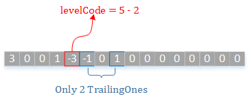
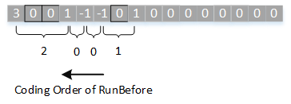

在H.264标准中，CAVLC（Context-based Adaptive Variable Length Coding）被用于亮度和色度残差数据编码。在标准的码流结构中，CAVLC编码方式描述为ce(v)。如果在编码时采用CAVLC，那么尽管在DCT时是以8x8块为单位进行的，在进行CAVLC时也会强制采用4x4块为单位进行编码（请参考[h.264语法结构分析](http://www.cnblogs.com/TaigaCon/p/5215448.html)中的redisual_luma部分）。在进行熵编码之前，需要把4x4块的矩阵中的元素按照一定顺序重新排列成大小为16的序列，这部分工作请参考[h.264 scanning process for transform coefficients](http://www.cnblogs.com/TaigaCon/p/5245108.html)，熵编码就是以这些序列为基础进行编码的。

CAVLC可分为五个部分

1. 编码非零系数的数目（TotalCoeffs）、拖尾系数（TrailingOnes）的数目
2. 对每个拖尾系数（TrailingOnes）的符号进行编码
3. 对除了拖尾系数之外的非零系数（level）进行编码
4. 对最后一个非零系数前面零的数目（TotalZeros）进行编码
5. 对每个非零系数前面连续的零的个数（RunBefore）进行编码

# 一. 编码TotalCoeffs,TrailingOnes
**TotalCoeffs**：非零系数数目。变换系数level中所有不为0的level的数目。
**TrailingOnes**：拖尾系数的数目。指的是矩阵重排列后，序列末尾连续出现的$\pm 1$的个数（中间可以间隔任意多个0）。如果$\pm 1$的个数大于3个，则只有最后三个$\pm 1$会被视为拖尾系数，其余的被视为普通的非零系数。
我们用一个例子来解释TotalCoeffs以及TrailingOnes

在上述例子中，共有5个非零系数，因此TotalCoeffs为5；其中有四个非零系数都是$\pm 1$，只有最后三个被视为拖尾系数，因此TrailingOnes为3。

TotalCoeffs与TrailingOnes是一起进行编码的，编码通过查表的方式进行，码表请参考标准中的表9-5。
用来编码TotalCoeffs与TrailingOnes的码表，需要根据变量nC的值进行选择。除了色度的直流系数（Chroma DC）之外，其它系数类型的nC值是根据当前块左边4x4块的非零系数数目（nA）和当前块上边4x4块的非零系数数目（nB）求得。nC的求值过程见下表。其中“X”表示与当前块同属于一个slice并可用。

另外，如果输入的系数是色度的直流系数（而且视频格式为4：2：0），nC=-1；如果输入的系数是色度的直流系数（而且视频格式为4：2：2），nC=-2。

原理上说，nC代表了当前块的相邻块非零系数的情况，由于块与块之间的相关性，当我们知道了相邻块的非零系数的情况，就有很大概率知道了当前块非零系数的情况。有了概率，h.264标准在这里引入了huffman编码，不过huffman的编码过程不用我们自己处理，h.264标准已经根据实验得到的数据组合成了码表9-5。

# 二. 对TrailingOnes的符号进行编码
在第一步时，对于TrailingOnes，我们只编码了它的个数。在这一步，我们对TrailingOnes的符号进行编码。对每个拖尾系数需要用一个bit表示它的符号。标准规定用0表示“+”，用1表示“-”。编码顺序是按照扫描逆序进行，也就是从高频数据开始。

# 三. 对除了拖尾系数之外的非零level进行编码
除了拖尾系数之外的非零level可能会有多个，编码顺序与上述TrailingOnes的一样，也是逆序进行。

对于每个level，编码结果包括两部分：前缀（level_prefix）和后缀（level_suffix）。

其中前缀的码值需要根据level_prefix的值去参照标准中的表9-6，后缀的码值就是level_suffix的二进制。

如何计算level_prefix以及level_suffix的这部分比较麻烦，我们有必要照着标准分析。
标准规定了CAVLC解码的步骤如下，我们能根据这些步骤逆推出它的编码步骤

1. The syntax element level_prefix is decoded as specified in clause 9.2.2.1.
2. The variable levelSuffixSize is set as follows:
  * If level_prefix is equal to 14 and suffixLength is equal to 0, levelSuffixSize is set equal to 4.
  * Otherwise, if level_prefix is greater than or equal to 15, levelSuffixSize is set equal to level_prefix − 3.
  * Otherwise, levelSuffixSize is set equal to suffixLength.

3. The syntax element level_suffix is decoded as follows:
  * If levelSuffixSize is greater than 0, the syntax element level_suffix is decoded as unsigned integerrepresentation u(v) with levelSuffixSize bits.
  * Otherwise (levelSuffixSize is equal to 0), the syntax element level_suffix is inferred to be equal to 0.

4. The variable levelCode is set equal to ( Min( 15, level_prefix ) << suffixLength ) + level_suffix.
5. When level_prefix is greater than or equal to 15 and suffixLength is equal to 0, levelCode is incremented by 15.
6. When level_prefix is greater than or equal to 15( 16 is the same ), levelCode is incremented by (1<<( level_prefix − 3 )) − 4096.
7. When the index i is equal to TrailingOnes( coeff_token ) and TrailingOnes( coeff_token ) is less than 3, levelCode is incremented by 2.
8. The variable levelVal[ i ] is derived as follows:
  * If levelCode is an even number, levelVal[ i ] is set equal to ( levelCode + 2 ) >> 1.
  * Otherwise (levelCode is an odd number), levelVal[ i ] is set equal to ( −levelCode − 1) >> 1.

9. When suffixLength is equal to 0, suffixLength is set equal to 1.
10. When the absolute value of levelVal[ i ] is greater than ( 3 << ( suffixLength − 1 ) ) and suffixLength is less than 6, suffixLength is incremented by 1.
11. The index i is incremented by 1.
下面的分析过程会把这些步骤记为“上述步骤”

#### 1. 有符号的level转换为无符号的levelCode
我们知道level的值可能为正，也可能为负，是带符号的，我们需要把它转化成无符号的levelCode以供后面的计算。根据（上述步骤8），我们知道在进行CAVLC编码时levelCode的计算方式如下：
如果$level$为正，$levelCode = (|level|-1)<<1$
如果$level$为负，$levelCode = (|level|-1)<<1+1$
因此有以下转换

可以看到正的level变成了levelCode中的偶数部分，负的level变成了levelCode的奇数部分，及levelCode中的最低位的bit代表符号。
此外，存在一种需要调整levelCode大小的情况：如果当前编码块的拖尾系数的个数小于3（TrailingOnes < 3），那么需要对第一个进行编码的非零非拖尾level的levelCode减去2（上述步骤7）。

#### 2. levelCode的拆分
这部分我们首先需要了解这两个变量的含义
**levelSuffixSize：**后缀level_suffix的实际长度
**suffixLength：**在某些情况下，levelSuffixSize等于这个变量的值，suffixLength也用于计算前缀的值，它贯穿于整个CAVLC编码过程，会在一个宏块开始编码level时进行初始化（见下述标准中抓取的部分），并且在每个level编码后进行更新。

* If TotalCoeff( coeff_token ) is greater than 10 and TrailingOnes( coeff_token ) is less than 3, suffixLength is set
equal to 1.
* Otherwise (TotalCoeff( coeff_token ) is less than or equal to 10 or TrailingOnes( coeff_token ) is equal to 3),
suffixLength is set equal to 0.
suffixLength会根据宏块的非零系数以及拖尾系数的个数被初始化为0或者1；在每个level编码后的更新，如果此时suffixLength为0，则suffixLength加1（上述步骤9），这意味着我们在对一个宏块进行CAVLC时，最多只有一次是suffixLength为0；如果此时已被编码的level大于( 3 << ( suffixLength − 1 ) ) ，suffixLength也会加1（上述步骤10）。

根据上述标准，在拆分levelCode上我们可以分成两大类情况

##### 1. suffixLength为0
其中可细分为三种情况进行编码
①  如果$| level |<8$，那么levelSuffixSize为0，也就是没有后缀level_suffix，这些level分别为$\pm 1,\pm 2,…,\pm 7$，这14个level由$level\_prefix = 0,1,2,…,13$表示。（上述步骤2第3条）
②  如果$8 \leqslant | level |<16$，那么levelSuffixSize为4，也就是后缀共有四个bit，也就是说后缀能表达16个level，由于此时固定了$level\_prefix=14$，因此这种情况能表达的level就是16个，即$\pm 8,\pm 9,…,\pm 15$。（上述步骤2第1条）
③  否则，$level\_prefix\geqslant 15$。这种情况下，levelSuffixSize的值为level_prefix-3（上述步骤2第2条）。此时levelCode在解码端的计算方法为
$\begin{align*}
levelCode
&=\underbrace{ \left\lfloor 15, level\_prefix \right\rfloor << suffixLength  + level\_suffix}_{step.4} \quad \underbrace{+15}_{step.5}\quad \underbrace{+1<<(level\_prefix-3)-4096}_{step.6}\\
&=15<<0+level\_suffix+15+ 1<<(level\_prefix-3)-4096\\
&=level\_suffix+1<<(level\_prefix-3)-4066
\end{align*}$
其中level_prefix的值为$15,16,…$，在编码端，levelCode已知，我们只需要按照递增顺序一个一个带入level_prefix，并且保证level_suffix在其所占用 的bit的范围内，即可得出合适的level_prefix与level_suffix。

JM18.6代码如下
int writeSyntaxElement_Level_VLC1(SyntaxElement *se, DataPartition *dp, int profile_idc)
{
  int level  = se->value1;
  int sign   = (level < 0 ? 1 : 0);
  int levabs = iabs(level);

  if (levabs < 8)      //① level_prefix < 14        ((8-1)*2 - len(inf) = 14 - 1)
  {
    se->len = levabs * 2 + sign - 1;
    se->inf = 1;
  }
  else if (levabs < 16)    //② level_prefix = 14        (len - len(inf) = 19 - len(16) = 19 - 5 = 14)
  {
    // escape code1
    se->len = 19;
    se->inf = 16 | ((levabs << 1) - 16) | sign;
  }
  else     //③ level_prefix >= 15           (28 - len(4096) + numPrefix = 15 + numPrefix)
  {
    int iMask = 4096, numPrefix = 0;
    int levabsm16 = levabs + 2032;

    // escape code2   select level_prefix, which level_prefix = 15 + numPrefix
    if ((levabsm16) >= 4096)
    {
      numPrefix++;
      while ((levabsm16) >= (4096 << numPrefix))
      {
        numPrefix++;
      }
    }
   
    iMask <<= numPrefix;
    se->inf = iMask | ((levabsm16 << 1) - iMask) | sign;
  /*  caution : int levabs = iabs(level);
   *
   *    (levabsm16 << 1) - iMask
   *  = ((levabs + 2032) << 1) - (4096 << numPrefix)
   *  = ((iabs(level) + 2032) << 1) - (4096 << numPrefix)
   *  = ((iabs(level) - 1 + 2033) << 1) - (1 << levelSuffixSize)
   *  = ((iabs(level) - 1 + 2048 - 15) << 1) - (1 << levelSuffixSize)
   *  = ((iabs(level) - 1 - 15) << 1) + 4096 - (1 << levelSuffixSize)
   *  = ((iabs(level) - 1 - 15) << 1) - ((1 << levelSuffixSize) - 4096)
   *
   *  belonging to above,you can find the relationship from the spec
   */

    /* Assert to make sure that the code fits in the VLC */
    /* make sure that we are in High Profile to represent level_prefix > 15 */
    if (numPrefix > 0 && !is_FREXT_profile( profile_idc ))
    {
      //error( "level_prefix must be <= 15 except in High Profile\n",  1000 );
      se->len = 0x0000FFFF; // This can be some other big number
      return (se->len);
    }
    
    se->len = 28 + (numPrefix << 1);
  }

  symbol2vlc(se);

  writeUVLC2buffer(se, dp->bitstream);

  if(se->type != SE_HEADER)
    dp->bitstream->write_flag = 1;

#if TRACE
  if(dp->bitstream->trace_enabled)
    trace2out (se);
#endif

  return (se->len);
}

##### 2. suffixLength为N （N = 1,2,3,4,5,6）
suffixLength不为0的情况下，可细分为以下两种编码过程
①  如果$levelCode<( 15<< suffixLength )$，为什么这里会有个15呢？因为15表明当前level所需要的level_prefix小于15，即（0~14）共15个数值。此时
$\begin{Bmatrix}
levelSuffixSize=suffixLength\qquad\qquad\qquad\qquad\qquad\quad & (step.2.1) \\
levelCode = level\_prefix<<suffixLength + level\_suffix & (step.4)
\end{Bmatrix}$
按照这两个条件，得到
$\begin{Bmatrix}
level\_prefix &= &levelCode >> suffixLength \\
level\_suffix &= &levelCode \ \& \ \underbrace{11...1}_{suffixLength}
\end{Bmatrix}$

②  否则，表明编码需要的level_prefix大于或等于15。$levelSuffixSize = level\_prefix-3 \quad $（上述步骤2第2条）。解码规定了此时的levelCode为
$\begin{align*}
levelCode
&=\underbrace{ \left\lfloor 15, level\_prefix \right\rfloor << suffixLength  + level\_suffix}_{step.4} \quad \underbrace{+1<<(level\_prefix-3)-4096}_{step.6}\\
&=15<<suffixLength + level\_suffix + 1<<(level\_prefix-3)-4096
\end{align*}$
在编码level端，levelCode与suffixLength已知，我们只需要按照递增顺序一个一个带入level_prefix，并且保证level_suffix在其所占用 的bit的范围内，即可得出合适的level_prefix与level_suffix。

JM18.6代码如下
int writeSyntaxElement_Level_VLCN(SyntaxElement *se, int vlc, DataPartition *dp, int profile_idc)
{  
  int level  = se->value1;
  int sign   = (level < 0 ? 1 : 0);
  int levabs = iabs(level) - 1;  

  int shift = vlc - 1;        
  int escape = (15 << shift);    //level_prefix = 15

  if (levabs < escape)   //① level_prefix < 15
  {
    int sufmask   = ~((0xffffffff) << shift);
    int suffix    = (levabs) & sufmask;

    se->len = ((levabs) >> shift) + 1 + vlc;
    se->inf = (2 << shift) | (suffix << 1) | sign;
  }
  else  // ② 
  {
    int iMask = 4096;
    int levabsesc = levabs - escape + 2048;  //+2048 * 2 = +4096 , on decode endpoint, would -4096
    int numPrefix = 0;

    if ((levabsesc) >= 4096)  //level_prefix = 15 + numPrefix
    {
      numPrefix++;
      while ((levabsesc) >= (4096 << numPrefix))
      {
        numPrefix++;
      }
    }

    iMask <<= numPrefix;
    se->inf = iMask | ((levabsesc << 1) - iMask) | sign;
  /*  caution : levabs = iabs(level) - 1;  
   * 
   *    (levabsesc << 1) - iMask
   *  = ((levabs - escape + 2048) << 1) - (4096 << numPrefix)
   *  = ((iabs(level) - 1 - escape) << 1) + 4096 - (1 << levelSuffixSize)
   *  = ((iabs(level) - 1 - escape) << 1) - ((1 << levelSuffixSize) - 4096)
   *
   *  belonging to above,you can find the relationship from the spec
   */

    /* Assert to make sure that the code fits in the VLC */
    /* make sure that we are in High Profile to represent level_prefix > 15 */
    if (numPrefix > 0 &&  !is_FREXT_profile( profile_idc ))
    {
      //error( "level_prefix must be <= 15 except in High Profile\n",  1000 );
      se->len = 0x0000FFFF; // This can be some other big number
      return (se->len);
    }
    se->len = 28 + (numPrefix << 1);
  }

  symbol2vlc(se);

  writeUVLC2buffer(se, dp->bitstream);

  if(se->type != SE_HEADER)
    dp->bitstream->write_flag = 1;

#if TRACE
  if(dp->bitstream->trace_enabled)
    trace2out (se);
#endif

  return (se->len);
}

#### 3. 更新suffixLength
上面我们说过，suffixLength贯穿整个宏块非零level的编码过程，它在一开始会被初始化，然后在每个level编码完成后进行更新。更新遵循两个规则：

* 如果suffixLength为0，则更新为1。（上述步骤9）
* 如果当前编码的level有$|level|>( 3<< suffixLength -1 )$，并且$suffixLength<6$，则suffixLength++。（上述步骤10）
CAVLC在编码非零level这部分，首先编码顺序就是从高频到低频进行，一般来说高频level会比较小，低频level较大，因此CAVLC中的做法就是令suffixLength初始化为0，或者1，后续基于上下文对suffixLength进行增加，这样做是为了出现频率更高的高频的level占用更小的bit，这也符合变长编码的思想。

# 四. 对TotalZeros进行编码
**TotalZeros**：  最后一个非零系数前零的总数目，如下图例子为TotalZeros = 3，码值需要根据当前宏块的TotalCoeffs以及TotalZeros查表得到。
需要注意的是，在对Chroma DC进行CAVLC时，Chroma DC块可能为2x2块（4:2:0）或者2x4块（4:2:2），这些都是要查不同的表格的。

# 五. 对RunBefore进行编码
**RunBefore**：  这个值是对于非零系数来说的，表示的是当前非零系数前面连续出现的0的个数
**ZeroLeft**：  这个值也是对于非零系数来说的，表示的是当前非零系数前的0的总个数，在一开始这个值会被赋值为TotalZeros。当ZeroLeft为0的时候意味着后续非零系数的RunBefore都为0，编码结束。
我们根据RunBefore与ZeroLeft的值查表9-10得到码值。编码顺序也是逆序进行，编码次数最多为TotalCoeffs - 1。

如上述例子
编码过程如下：
ZeroLeft = 3，RunBefore = 1，码值为10
ZeroLeft = 2，RunBefore = 0，码值为1
ZeroLeft = 2，RunBefore = 0，码值为1
ZeroLeft = 2，RunBefore = 2，码值为00
ZeroLeft = 0，RunBefore = 0，不需要码流表示

