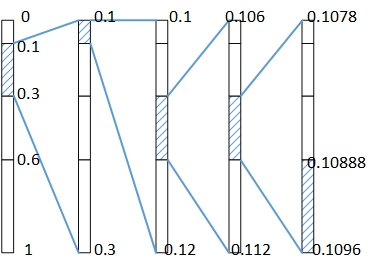
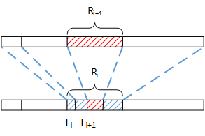
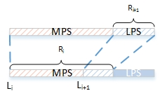
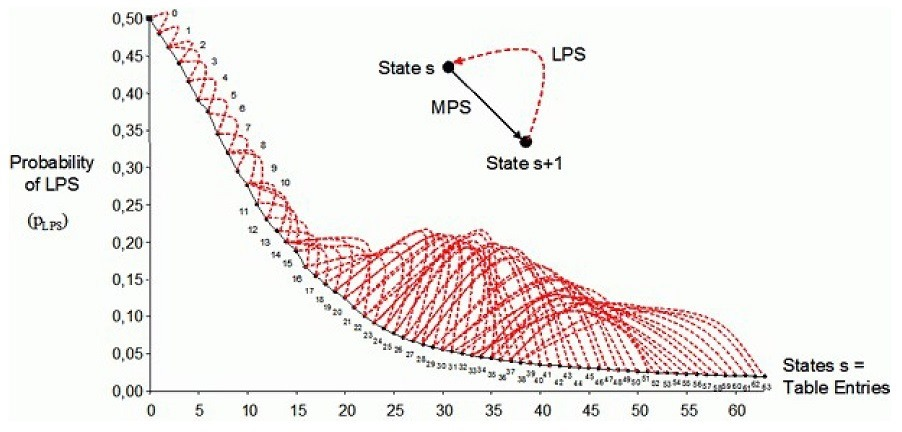
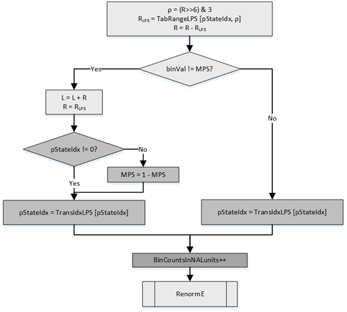
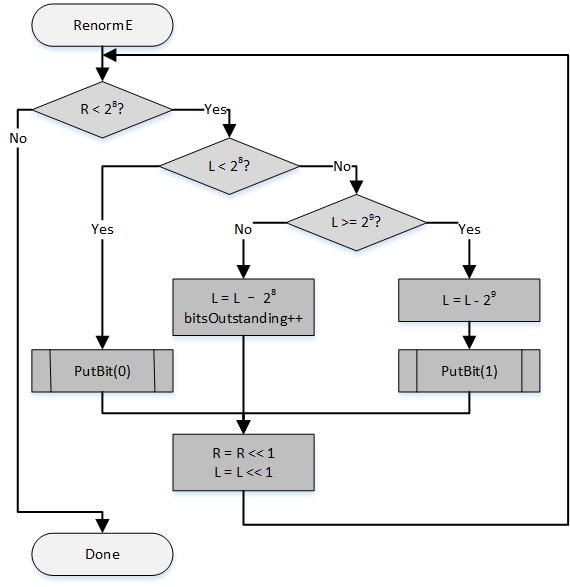
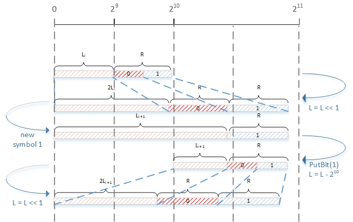

CABAC（Context-based Adaptive Binary Arithmetic Coding），基于上下文的自适应二进制算术编码。CABAC是H.264/AVC标准中两种熵编码中的一种，它的编码核心算法就是算术编码（Arithmetic Coding）。

# 算术编码

#### 传统编码算法
算术编码与传统的编码方法有很大的区别，传统编码是通过符号映射实现的。映射包含符号（symbol）与码字（codeword）两个要素，如下面的例子

通过上述的映射表，我们可以把“**hello**”编码成码流**01 00 10 10 11**。
而诸如Haffuman，Shannon这些编码方法也没脱离这种编码模式，他们只是通过符号出现的概率对码字进行调优。

#### 算术编码
算术编码采用的并非上述这种传统的单符号映射模式进行编码，它不是将单个符号映射成一个码字，而是从全序列出发，将输入的符号依据它的概率映射到[0,1)内的一个小区间上，如此递归地进行区间映射，最后得到一个小区间，从该区间内选取一个代表性的小数作为实际的编码输出。
如下面为算术编码的例子

假设需要编码的符号只有“**e**”,“**h**”,“**l**”，“**o**”四个，他们出现的总概率为1，各个符号出现的概率如上述表格所示。现要求“**hello**”经过算术编码后的码字。

算术编码有如下编码步骤：

##### 1. 首先我们需要根据概率设定各符号在[0,1)上的初始区间，其中区间的起点为表中前面的符号的累计概率

“**hello**”的第一个符号为“**h**”，那么映射的区间为[0.1,0.3)。

##### 2. 接下来我们需要根据符号的概率分割[0.1,0.3)上的区间，得到的结果如下

“**hello**”的第二个符号为“**e**”，那么映射的区间为[0.1,0.12)。

##### 3. 按照这种方式继续进行区间映射，最终“hello”映射到的区间是[0.10888,0.1096)

##### 4. 从区间[0.10888,0.1096)中任取一个代表性的小数，如“0.109”就是编码“hello”后的输出值

算术编码的总体的编码流程可以参考下图

算术编码总体上可以按照如下进行描述：

* 设输入符号串为$s$，$s$中的符号值取自符号集$S=\{ a_1,a_2,a_3,…,a_m \}$
* 这些符号出现的概率分别为$p(a_k) = \{ p_1,p_2,p_3,…,p_m \}$
* 这些符号的累计概率为$P(a_k) = \displaystyle{ \sum_1^{i-1}p_k }$。累计概率可以理解为，如果区间为[0,1)时，该符号的区间起点的位置。
* 区间大小更新为$R_{i+1} = R_{i}p(a_k)$，初始值为$R_0 = 1$
* 区间的起点更新为$L_{i+1} = L_{i}+P(a_k)R_i$，初始值为$L_0 = 0$

当处理符号$a_k$时，区间$R$宽度根据$a_k$出现概率$p(a_k)$而变窄，符号序列越长，相应的子区间越窄，编码的位数越多。

算术解码就只是需要判断代表性的小数在哪个区间，相应地就知道输入的符号了。

# 二进制算术编码
二进制算术编码的编码方法跟算术编码是一样的，但是输入只有两个符号：“0”，“1”，也就是说输入的是二进制串。
除了是对二进制串进行编码这个特征外，二进制算术编码跟普通的算术编码还有一些区别，总体上可以按照如下进行描述：

1. 设输入符号串为$s$，$s$中的符号分为两种：MPS(Most Probability Symbol)，LPS(Low Probality Symbol)，分别代表出现概率大小的符号，需要根据实际情况进行调整。如果输入的二进制串中的“0”较多，“1”较少，那么MPS = “0”，LPS =“1”
2. LPS出现的概率为$p_{LPS}$，MPS出现的概率为$p_{MPS} = 1- p_{LPS}$
3. 在编码中进行区间选择时，MPS在前，LPS在后，因此
  * LPS的累计概率为$P_{LPS} = p_{MPS} = 1-p_{LPS}$
  * MPS的累计概率为$P_{MPS} = 0$

4. 区间大小的更新为
  * 如果当前编码的是LPS：$R_{i+1} = R_{LPS} = R_{i}\cdot p_{LPS}$
  * 如果当前编码的是MPS：$R_{i+1} = R_{MPS} = R_{i}-R_{LPS} =  R_i –(R_{i} \cdot p_{LPS})$

5. 区间的起点更新为
  * 如果当前编码的是LPS：$L_{i+1} = L_{i} + R_{MPS}$
  * 如果当前编码的是MPS：$L_{i+1} = L_{i}$

# CABAC编码
CABAC采用的是二进制算术编码，在编码过程中需要传入二进制串，输出的也是二进制串。
在h.264标准中，CABAC在语法结构中用ae表示，它只用于编码slice_data中的语法元素（包括slice_data内部的子模块的语法元素，请参考[h.264语法结构分析](http://www.cnblogs.com/TaigaCon/p/5215448.html)）
CABAC实现分为四个部分

* 上下文变量的初始化
* 待编码语法元素二值化
* 上下文建模（确定上下文索引）
* 算术编码

#### 1. 上下文变量的初始化
初始化执行于slice开始之前，另外如果在编码过程中某个宏块是PCM宏块，那么在PCM宏块之后，编码下一个宏块之前也需要进行初始化。
初始化主要工作就是确定所有上下文的初始MPS以及初始状态pStateIdx。求解方法如下
preCtxState = Clip3( 1, 126, ( ( m ∗ Clip3( 0, 51, SliceQPY ) ) >> 4 ) + n )

if( preCtxState <= 63 ) {
    pStateIdx = 63 − preCtxState
    valMPS = 0                           ( 9-5)
} else {
    pStateIdx = preCtxState − 64
    valMPS = 1
}

上面的计算依赖于SliceQPY，m，n三个变量，其中不同的上下文索引（contex Index）对应不同的m、n，具体的m、n的取值请参考标准9.3.1中的各个表格。上下文索引是基于语法元素以及二值化后的二进制串的索引binIdx，我们将在下一小节进行阐述。
在CABAC的初始化过程的结果会得到所有上下文索引对应的MPS与pStateIdx的初始值。如果确定了MPS为“0”，那么LPS为“1”，反之如果MPS为“1”，那么LPS为“0”。状态pStateIdx是什么呢？
状态pStateIdx是LPS出现的概率$p_{LPS}$的索引。算术编码中最重要的要素就是符号的概率，CABAC是自适应的算术编码，也就是说符号的概率会随着符号的输入而改变，这种变化就是一种状态机，如果输入的是LPS的话，状态（概率）会怎样变化，如果输入的是MPS的话，状态（概率）又会怎么变化。CABAC的状态机转换的规则由HOWARD与VITTER的"exponential aging"模型借鉴而来，转换规则如下
${p^{(t+1)}}_{LPS}= \left\{\begin{matrix}
\alpha \cdot {p^{t}}_{LPS}\qquad\qquad & if\ an\ MPS\ occurs\\
\alpha \cdot {p^{t}}_{LPS} + (1-\alpha) &if\ an\ LPS\ occurs
\end{matrix}\right.$
在CABAC中规定了LPS的概率取值范围是$p_{LPS}\in [0.01875,0.5]$，由于LPS是小概率符号，因此它的概率肯定是小于0.5的，如果某个小概率符号在状态转换的过程中超出了0.5，此时我们就需要把MPS与LPS进行交换。
CABAC的状态机中共有64个状态，pStateIdx = 0,1,2,…,63，分别代表64个不同的概率，除了pStateIdx = 63外，其他的63个状态都满足上述状态转换规则，其中
$\left\{\begin{matrix}
{p^{0}}_{LPS}=0.5 \qquad\\
{p^{62}}_{LPS}=0.01875
\end{matrix}\right.$
结合上述状态机的转换规则，我们可以得到状态转换参数
$\alpha = \left( \frac{0.01875}{0.5} \right)^{1/63} \approx 0.95$

CABAC状态机的状态转换如下图（黑色实线代表输入的是MPS，红色虚线代表输入的是LPS），具体的pStateIdx变换请参考标准的表9-45

#### 2. 待编码语法元素二值化
CABAC编码的是slice data中的语法元素，在进行算术编码前，需要把这些语法元素按照一定的方法转换成适合进行二进制算术编码的二进制串，这个转换的过程被称为二值化（binarization）。
二值化的方案共有7种

##### 1. 一元码（Unary）
对于一个非二进制的无符号整数值符号$x \geqslant 0$，在CABAC中的一元码码字由$x$个“1”位外加一个结尾的“0”组成，见下表。例如，输入的语法元素值为3，其二值化结果为1110

##### 2. 截断一元码（TU，Truncated Unary）
一元码的变体，用在已知语法元素的最大值cMax的情况。对于$0\leqslant x < cMax$的范围内的取值，使用一元码进行二值化。对于$x = cMax$，其二值化的二进制串全部由“1”组成，长度为cMax。例如，当cMax=5时，语法元素值为4的二进制串为11110，语法元素值为5的二进制串为11111。

##### 3. k阶指数哥伦布编码（kth order Exp-Golomb，EGk）
指数哥伦布编码由前缀和后缀组成。其中前缀部分由$l(x) = \left \lceil log_2(x/2^k+1) \right \rceil$的值所对应的一元码组成；后缀部分可通过使用长度为$k+l(x)$位的$x+2k(1-2l(x))$的二进制值来计算。详细的计算过程请参考[指数哥伦布编码](http://www.cnblogs.com/TaigaCon/p/3571651.html)，请注意两者前缀区别。

##### 4. 定长编码（FL，Fixed-Length）
用定长编码二进制的无符号语法元素， 语法元素的最大值cMax已知，那么定长编码的长度为$fixlength = \left \lceil log_2(cMax+1) \right \rceil$，其中值就是语法元素的值的二进制。定长编码用于近似均匀分布的语法元素的二值化。

##### 5. mb_type与sub_mb_type特有的查表方式
详情请查看h.264标准中9.3.2.5小节

##### 6. 4位FL与截断值为2的TU联合二值化方案
这种方案只用于对语法元素CBP的二值化。4位的FL（cMax=15）的前缀用于编码亮度CBP，2位的TU用于编码色度CBP（当色彩格式为4:2:0或4:2:2时才会存在这个后缀）

##### 7. TU与EGk的联合二值化方案（UEGk，Unary/kth order Exp-Golomb）
这种方案的前缀使用一元截断码，后缀使用k阶哥伦布编码。但是在取值较小的范围内，只用一元码表示（即只有前缀部分）。对于不同的语法元素，有不同的截断值与阶数。如下表为abs_level_minus1的二值化表(cMax=14的TU、0阶哥伦布编码)

*:abs_level_minus1Prefix (TU)

具体哪个语法元素选择哪种二值化方案，请查看标准9.3.2中d第一个表格。

#### 3. 上下文建模（确定上下文索引）
在前面初始化的时候就出现了上下文这个概念，那么上下文所指的是什么？
以JM中的上下文结构体为例
//! struct for context management
struct bi_context_type   
{ 
   unsigned long  count;  
   byte state; //uint16 state;         // index into state-table CP
   unsigned char  MPS;           // Least Probable Symbol 0/1 CP  
};
上下文包含两个变量：MPS、pStateIdx（count只是用于计数）。在CABAC编码的过程中会碰到需要修改这两个值的情况（如上面的状态变换），这些修改都是以上下文为单位的。
语法元素在经过二值化后形成二进制串，二进制串中不同binIdx位置上的MPS（出现频率高的符号）可能会有所不同，并且概率也可能会不同，因此需要用一个概念来表示特定语法元素的二进制串中特定binIdx的MPS与pStateIdx，上下文就是这样的概念。

在h.264标准中，用一个上下文索引ctxIdx来代表上下文，ctxIdx的取值为0~1023，就是说h.264的上下文一共有1024个。

ctxIdx的计算方式分为两种:
如果语法元素为coded_block_flag、significant_coeff_flag、last_significant_coeff_flag、coeff_abs_level_minus1，即残差系数部分的语法元素，则
**ctxIdx = ctxIdxOffset + BlockCatOffset(ctxBlockCat) + ctxIdxInc(ctxBlockCat)**
否则
**ctxIdx = ctxIdxOffset + ctxIdxInc**

其中的变量有

* **ctxIdxOffset**每个语法元素都有一个ctxIdxOffset，甚至一些语法元素在二值化后分为前后缀会，这种语法元素可能会有两个ctxIdxOffset，如下表格部分摘自h.264标准9.3.2的第一个表格

* **ctxIdxInc**在特定的语法元素二值化后，会形成以binIdx为索引的二进制串，尽管是同一个二进制串，但是不同的binIdx上的上下文（MPS，pStateIdx）可能会有所不同，ctxIdxInc就是在这种情况下产生的一个值，它用于划分二进制串上不同的上下文。如下面一项表格摘自h.264标准9.3.3.1的第一个表格

ctxIdxOffset=40代表mvd的横向分量，上述表格描述了这个语法元素各个binIdx所对应的ctxIdxInc。也就是说mvd横向分量按照binIdx得到的ctxIdx如下表

像上面表格的这种binIdx=0中出现三个ctxIdx的情况，意思就是会根据编码的具体情况选择0、1或者2作为ctxIdxInc，需要另外分析。ctxIdxInc的确定方法具体请参考标准9.3.3.1小节

* **BlockCatOffset(ctxBlockCat)**其中ctxBlockCat的范围为0~13，分别代表不同残差块类型，如下表

在残差系数部分，上下文是会根据不同的残差块类型做出不同选择的，BlockCatOffset就代表了不同的残差块类型的索引偏移，具体偏移值可以查看标准中的相关表格。

#### 4. 算术编码
算术编码是基于区间划分的，普通的概率划分需要使用到多位乘法。CABAC的算术编码为了降低计算复杂度，并便于硬件实现，采取了如下一些方法：

1. 总是估计小概率符号LPS（$p_{LPS}<0.5$）的概率，并将其概率离散化成64个不同概率状态。概率估计转换成基于表格的概率状态的转换（见初始化部分的描述）。
2. 使用9bit的变量$R$与10bit的$L$表示当前区间，其中$L$为区间的起点，$R$为区间长度
3. 每当输入新符号时，会对区间的起点$L$以及区间的长度$R$进行更新，在前面的二进制算术编码时，我们已经得知两者的更新方法，其中$R$与$L$的更新包含了浮点数乘法$R_{i}\cdot p$，为了降低运算复杂度，CABAC把乘法换算成了查表的形式。换算方法如下：
  * 离散化的状态pStateIdx代表了符号的概率$p$
  * 9个bit的区间长度$R$通过$(R>>6) \& 3$被量化成2个bit，即$\{0，1，2，3\}$（因为$R$总是大于等于$2^8$小于$2^9$，在后面的归一化可以看出来）
  * 有了上述两个离散的变量，区间更新所需要的乘法就能转换成查表操作，表格请查看标准9.3.3.2中的第一个表格。

4. 在算术编码的过程中，尽管是同一上下文，但是概率并不是固定的，每次输入一个新符号都会改变相应上下文的概率，也就是会进行状态转换（见初始化部分的描述）
5. 对近似均匀分布的语法元素，在编码和解码时选择盘路（bypass）模式，可以免除上下文建模，提高编解码的速度。
6. 由于编码区间是有限位表示的，因此在输入一个符号进行区间更新后，需要进行重归一化以保证编码精度。

##### **算术编码过程**

该过程可分为5个步骤

1. 通过当前编码器区间范围$R$得到其量化值$\rho$作为查表索引，然后利用状态索引$pStateIdx$与$\rho$进行查表得出$R_{LPS}$的概率区间大小。
2. 根据要编码的符号是否是MPS来更新算术编码中的概率区间起点$L$以及区间范围$R$
3. $pStateIdx == 0$表明当前LPS在上下文状态更新之前已经是0.5的概率，那么此时还输入LPS，表明它已经不是LPS了，因此需要进行LPS、MPS的转换
4. 更新上下文模型概率状态
5. 重归一化，输出编码比特。

##### 重归一化分析
在区间划分结束后，如果新的区间不在$[2^8,2^9)$之内，即$R<256$，256是最大编码区间的$\frac{1}{4}$，那么就需要进行重归一化操作（incremental output and interval expansion），输出一位或多位编码比特。重归一化过程如下图所示。

在CABAC编码过程中，在输入符号后，进行区间更新，接下来就是重归一化过程。下面就以$[0,2^{10})$表示区间$[0,1)$为例，分析重归一化过程
（请注意，在该过程中，$[0,2^{10})$只起到辅助作用，实际的区间为$R$）

1. $R < 2^8$的情况，如果$L < 2^8$，则可知$R + L < 2^9$，那么可以确定编码区间$[L, L+R)$在区间$[0, 0.5)$上，用二进制表示这个区间即为$0.0x$，因此输出$0$（只记录小数点后面的二进制）。最后用$[0,2^{10})$来表示区间$[0,0.5)$，也就是将原本的$[0,2^9)$线性扩增到$[0,2^{10})$
2. $R < 2^8$的情况，如果$L \geqslant 2^9$，那么就可以确定编码区间$[L, L+R)$在区间$[0.5,1)$上，用二进制表示这个区间即为$0.1x$，因此输出$1$。最后用$[0,2^{10})$来表示区间$[0.5,1)$，也就是将原本的$[2^9,2^{10})$线性扩增到$[0,2^{10})$
3. $R < 2^8$的情况，如果$2^8 \leqslant L < 2^9$，则$2^8 < R+L < 2^9 + 2^8$，编码区间$[L, L+R)$可能在$[0,0.5)$区间内，也有可能跨越$[0,0.5)$与$[0.5,1)$两个区间，即可能是$0.01x$，也可能是$0.10x$。此时可以先暂缓输出，用$[0,2^{10})$来表示区间$[0.25,0.75)$，也就是将原本的$[2^8,2^8+2^9)$线性扩增到$[0,2^{10})$，然后进入重归一化的下一个循环继续判断。
4. $R \geqslant 2^8$的情况，无法通过$L < 2^8$来确定编码区间，需要通过输入下一个符号来对$R$与$L$进行更新后再继续进行判断，因此当前符号的编码流程结束。由于这个原因，因此在一个符号编码结束后，另一个符号编码开始前，总是$2^8 \leqslant R < 2^9$。

##### **输出**
在编码输出“0”或者“1”的阶段，用PutBit(B)表示

关于PutBit(B)的分析，参考上面重归一化的区间图，可以看到有三种情况

1. 情况1，走PutBit(0)，直接输出“0”
2. 情况2，走PutBit(1)，直接输出“1”
3. 情况3，输出可能为“10”或者“01”，因此不能直接输出，走bitsOutstanding++的步骤。在下一次编码符号时，符合情况2，走PutBit(1)，此时bitsOutstanding = 1，因此输出“10”
另外，PutBit(B)不会编码第一个bit。原因是CABAC在初始化的时候，会以$[0,2^{10})$表示区间$[0,1)$，而在初始化区间时$R=510，L=0$，这意味着已经进行了第一次区间选择，区间为$[0,0.5)$，需要输出“0”。PutBit(B)在此阻止这个“0”的输出，这样就能得到正确的算术编码结果了。

#### 旁路（bypass）编码
有些语法元素在二值化后选择的可能不是上述的算术编码，而是旁路编码，具体情况请查看h.264标准9.3.2的第一个表格。旁路编码中，假设待编码的符号符合近似的均匀分布。下图给出了旁路模式下的编码过程。
旁路模式有几个特点：符号均匀分布，无需对$R$进行量化与查表；每编码完一个符号后，$R$总是会小于$2^8$，因此每次都需要对概率区间进行放大；把对$L$的移位操作提到了前面，因此旁路编码的重归一化的区间可以看作由$[0,2^{10})$变成了$[0,2^{11})$。

下面是旁路编码的一个例子

#### 编码结束 EncodeTerminate
在编码语法元素end_of_slice_flag以及I_PCM mb_type时（ctxIdx = 276）会调用EncodeTerminate这个编码过程。
在EncodeTerminate中，采用的是pStateIdx = 63的状态，这个状态表示的是当前宏块是否为该slice的最后一个宏块的概率。在该状态下，对概率区间的划分跟概率区间量化值无关。在编码end_of_slice_flag以及I_PCM的mb_type时，概率区间固定为$R_{LPS} = 2$。如果当前宏块为slice的最后一个宏块（end_of_slice_flag = 1）或者当前编码为PCM宏块并且编码它的mb_type I_PCM时，结束CABAC编码，调用EncodeTerminate中的EncodeFlush。具体情况请参考标准中的9.3.4.5小节以及[CABAC补充讨论](http://www.cnblogs.com/TaigaCon/p/7018251.html)。

在编码完成slice的最后一个宏块后，将会调用字节填充过程。该过程会往NAL单元写入0个或者更多个字节（cabac_zero_word），目的是完成对NAL单元的封装（标准9.3.4.6）。这里有计算如下
$k = \left \lceil \left(\left \lceil 3\times \left(\frac{32\times BinCountsInNALunits - RawMbBits\times PicSizeInMbs}{1024}\right) \right \rceil - NumBytesInVclNalunits\right)/3 \right \rceil$
如果$k>0$，则需要将3字节长的0x000003添加到NAL单元$k$次。这里的前两字节0x0000代表了cabac_zero_word，第三个字节0x03代表一个emulation_prevention_three_byte，这两个语法元素请参考[h.264语法结构分析](http://www.cnblogs.com/TaigaCon/p/5215448.html)的相关部分。
如果$k \leqslant 0$，则无需添加字节到NAL单元。
**式子中的各个变量所代表的意思请查看标准**

