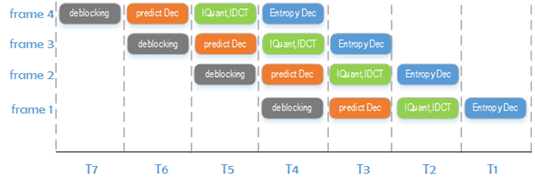
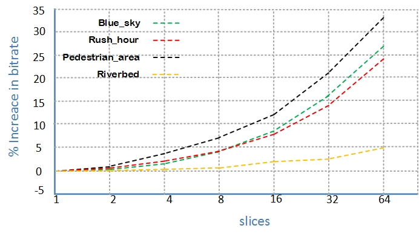
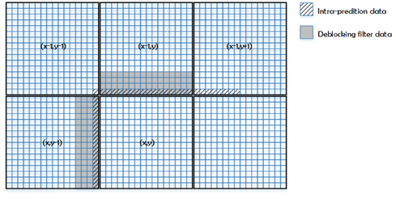
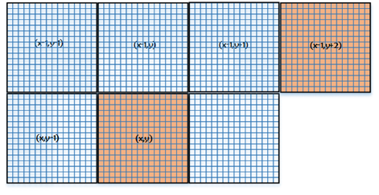
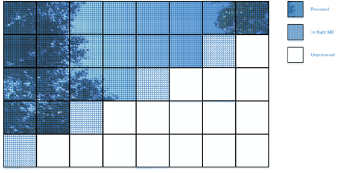
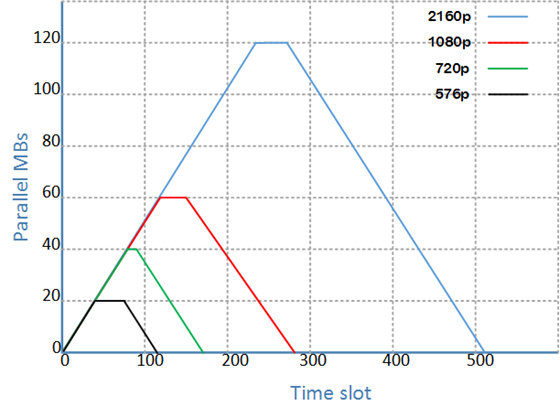
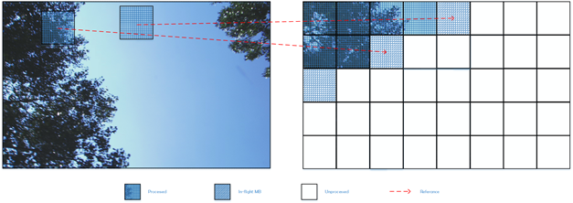
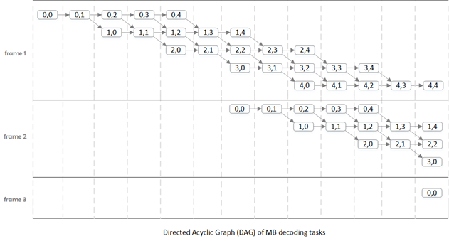
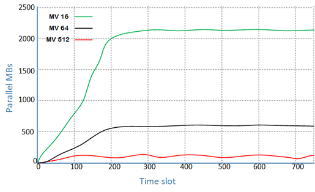
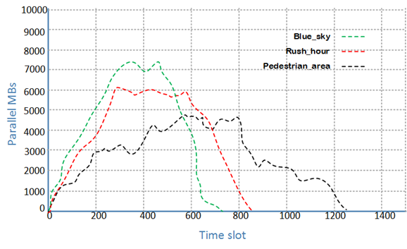

并行算法类型可以分为两类

* Function-level Decomposition，按照功能模块进行并行
* Data-level Decomposition，按照数据划分进行并行

# Function-level Decomposition
在h.264解码时进行功能划分，例如对于四核系统，各个核心分别执行下列任务

1. 熵解码framen
2. 逆量化、逆变换framen-1
3. 预测处理framen-2
4. 去块滤波framen-3

这种并行类型就是流水线类型，但这种类型在h.264解码中会出现以下问题

1. 各个功能部分耗费的时长不同，这依赖于实际的码流数据，处理数据的吞吐量取决于其中最耗时的部分。如果仅仅是吞吐量的问题还能采取缓冲的方式来进行流水线优化（一旦一个核心完成了一帧的任务后，对任务成果进行缓存，如果下一帧的上一步骤已经完成，便立刻开始下一帧处理），不过问题是在预测处理中，inter宏块部分需要进行运动补偿，也就是需要依赖到其他帧，这意味着需要等待它所依赖的帧完全解码完成后才能开始当前帧的处理，这就使得这种流水线类型的并行方法复杂多了。
2. 并行度的扩展是有限的，这种并行类型的并行度依赖于功能模块可以分成多少部分，例如上面的这个例子就分成四个功能部分，如此一来就只能分发给四个核心进行处理。
由于有上述的这些缺点，一般在h.264并行解码器实现中都不会采用这种实现方式。

# Data-level Decomposition
按照数据划分，在每部分进行划分并且处理后，还需要进行合并。在h.264中有多个级别的数据划分，这里挑出其中三个重点分析

#### 1. Frame-level Parallelism
h.264分为I、P、B帧，其中I、p被用作参考帧，B帧常被用作非参考帧。而并行算法，对于完全不相关的数据才能并行处理，即对作为非参考帧的B帧才能平行处理。如果采用这种并行算法，需要有一个核来解析码流，判断帧的类型并且把帧分配给不同的核进行处理。
它的缺点如下：

1. 有限扩展。一般来说P帧间的B帧都会比较少，因此并行度不高。
2. 在h.264中，B帧是可以作为参考帧的，在这种情况下，这种Frame-level的并行算法就会无法进行了。有一个解决方法就是在编码时规定B帧不作为参考帧（实际上x264在开启了并行编码时就不把B帧作为参考帧），但是这种编码方式会导致码流增加，并且我们这里讨论的是解码器，解码器与编码器是完全分开的，如果作为通用的h.264解码器就应该完全支持标准中的特性。
出于上述原因，一般在并行解码器实现中都不会采用这种实现方式。

#### 2. Slice-level Parallelism
在h.264中，与其他高级视频编码标准一样，每一帧都能分成一个或者多个slice。
slice的目的是为了增强传输出错时的鲁棒性，一旦传输出现错误，没有出错的slice并不会受到影响，这样的话视频的显示质量的下降就会比较有限。一帧的各个slice间是相互独立的，也就是说在熵解码，预测等各种解码操作时，slice间并不相互依赖。有了数据上的独立，就能对他们进行并行编码了。
它的缺点如下：

1. 一帧中的slice数目有编码器决定，一般不会太多。网上的h.264视频大多数都是一帧只有一个slice，这就导致slice-level的并行算法失去效果了。
2. 尽管slice间是相互独立的，但是在去块滤波（deblocking，在编码时是可选的）时，是能超越slice边界的，并且去块滤波必须按照正常的视频序列顺序进行，这会降低slice-level并行算法的速度。
3. 使用多slice编码方式的主要缺点就是视频码率会增大。在前面第一点时已经提到，一般都是一帧只有一个slice，如果一帧中的slice数目增多，明显的影响就是slice边界增多，在进行宏块的intra，inter预测时是不能跨过slice边界的。另外，slice数目增多意味着会有更多的slice_header与起始码。下图展示了1080p分辨率下4个不同视频的slice数目与码流增加的关系。在4个slice时，码率增加不到5%，这在高码率的应用中，如蓝光播放中是可以接受的。但是更多的slice就会带来更大的码流，要记住，视频压缩的主要目的是压缩，而不是并行处理，而且多slice的情况下，如果不采用去块滤波会使得视频质量下降。

由于上述的分析，一般在并行解码器实现中不会采用这种实现方式。

#### 3. Macroblock-level Parallelism
首先，宏块（Macroblock/MB）并不是完全独立的，为了能够进行并行解码，我们需要分析宏块之间的依赖关系，找出相互独立的宏块，以此来判断应该怎么并行。
其中可以分为两大类MB-level的并行算法

1. 2D-Wave
2. 3D-Wave

# 2D-Wave

##### 2D-Wave算法原理
2D-Wave就是把一帧内的宏块进行并行处理的算法。为了实行这种算法，我们必须考虑一帧内宏块间的依赖关系。
在h.264中，在宏块的intra预测、inter预测、deblocking等多个功能部分都会依赖到特定的相邻宏块，所依赖的宏块见下图

在单一线程中处理一帧时，对宏块处理的顺序是从左到右，从上到下。按照这种顺序，宏块的依赖在解码时，它依赖的宏块都是可用的。而并行算法要求并行处理的数据相互独立，那么相互独立的宏块出现在如下位置（knight-jump-diagonal）

在并行处理中，与一个宏块相互独立的最接近的宏块位于（右2，上1）的相对位置上，因此他们能够同时被处理。如下图，完整的是已被处理过的宏块，花格子的为正在被处理的宏块，空白的为未被处理的宏块。

这种算法被称为2D-Wave。
与frame-leve，slice-leve并行算法不同的是，2D-Wave有着良好的可扩展性，因为它最大的并行度，即可以同时处理的宏块数是依赖于帧的宽高
$ParMB_{max,2D} = min\left( \left \lceil mb\_width / 2 , mb\_height \right \rceil \right)$
如1080p的帧的宏块数目为（$120 \times 68 \ MBs$），它的最大并行度为$120/2 = 60$。

##### 2D-Wave的缺点

1. 在一帧处理的开始与末尾，并行度较低，如果是有多核的情况，那么在开始与结尾处就会有很多核出于空闲状态。
2. 在熵编码为CABAC的情况，slice中每个宏块的熵解码都与它前一个宏块相关，也就是每个宏块都是相关的，那么，只能在熵解码完成后才能开始进行并行重建宏块。

##### 2D-Wave的效率
我们前面讨论了2D-Wave中并行的方法，当前正在重建的宏块需要与相邻行正在进行重建的宏块相隔两个宏块，因此，并行解码可以得到以下DAG（Directed Acyclic Graph）。

上图是一个5x5宏块帧的DAG，横向为时间，纵向为帧内的每一行，每个结点代表一个宏块的解码，在这里我们假设每个宏块的解码时间相同，并忽略通信和同步所占用的时间。
DAG的深度（depth），即从开始到末尾的结点数目，也就是解码一帧所需要的时间，记为$T_{\infty}$。DAG的总结点数，也就是采用非并行解码时解码一帧所需要的时间，记为$T_{s}$。通过这两个理想状态下的数据，我们可以得到采用2D-Wave并行算法进行解码时的最大速度提升。
$SpeedUp_{max,2D} = \frac{T_s}{T_{\infty} }= \frac{mb\_width \times mb\_height}{mb\_width + 2\times(mb\_height - 1)}$
其中在解码过程中最大的并行度为
$ParMB_{max,2D} = min\left( \left \lceil mb\_width / 2 , mb\_height \right \rceil \right)$
按照上面的结论，可以算出常见分辨率视频在采用2D-Wave并行算法后的各项参数如下

并行度变化曲线如下

横轴为时间，以宏块为单位，0为第（0，0）个宏块的解码结点；纵轴为并行度。可以看到对于一帧的处理，并行度先增高后降低，平均并行度约为最大并行度的一半。

当然，上述分析都是基于“宏块解码时间相同”这一理想情况的。实际上，由于宏块类型不同等各种原因会使得宏块的解码时间不固定，这会需要同步机制来调整宏块的解码顺序，也就带来了相应的开销，因此无法达到理论上的最大速度提升。
为了分析2D-Wave在实际解码中的速度提升，我们可以在实际的解码器中进行模拟实验。如在ffmpeg解码器上，在解码一帧的时候，我们记录这一帧每一个宏块解码所需要的时间。结合这些时间数据与上述分析（宏块需要等待它依赖的宏块解码完成后才能开始解码），我们就能拼凑出实际解码一帧的DAG，因此可以得到2D-Wave在实际应用中的速度提升。
不同视频的速度提升见下表

以上视频均为1080p，理论上的速度提升为32.1，实际上平均下降了33%。

# 3D-Wave
2D-Wave已经可得到足够高的速度提升，但是如果在如100核的这种多核处理器环境下解码，2D-Wave就显得不够适用了。下面将讨论3D-Wave算法，这种算法就能很好地适用于多核，甚至超多核的解码环境。
3D-Wave算法基于一个现象：连续的帧之间通常不会存在超快速的运动，运动向量（MV）一般来说都会比较小。这就表明了在解码当前帧的某个宏块时，不需要等待前一帧完全解码完成，只要在当前宏块所依赖的参考宏块所在的区域重建完成后即可开始当前宏块的解码。当然，这种算法在同一帧上还是有与2D-Wave相同的约束条件，3D-Wave可以看作是2D-Wave的升级版。

3D-Wave算法分为两种实现方式

#### 1. Static 3D-Wave
h.264标准中定义了MV的最大长度（参见附件表A-1，请注意区别于最大搜索范围）。当视频为1080p时，MV最大长度为512像素。Static 3D-Wave算法就是统一以这个MV的最大值来作为当前解码宏块的依赖，也就是说只有当参考帧中的这个MV所覆盖的区域内的所有宏块全部完成重建后，才能开始当前宏块的重建。
为了分析Static 3D-Wave算法，我们需要像分析2D-Wave时一样，假设每个宏块的解码时长都是一样的，并且假设该算法在解码时出现以下情形。

1. B帧可以作为参考帧。这意味着任何帧都能作为参考帧。
2. 参考帧永远为视频序列的上一帧。这意味着只有等上一帧相关区域的宏块解码完毕后才能开始当前宏块解码，如此一来当前宏块开始解码的时间就会比参考帧不是上一帧的情况更加晚。
3. 只有第一帧为I帧，并且其他帧中不会出现intra宏块。这意味着除了第一帧之外，其他帧的宏块在解码是都有帧间依赖，也就是说需要等待它所依赖的参考帧上的相关宏块解码完成后才能开始当前宏块的解码。
上述情形对Static 3D-Wave算法而言是最坏的情况，基于这些假设，我们下面计算Static 3D-Wave的并行度。
在最大MV为16的情况下，如果当前解码的宏块为第二帧的宏块(0,0)，那么在第一帧中，最大MV所包含的宏块为(0,0)，(0,1)，(1,0)，(1,1)。不过由于需要进行子像素重建，重建插值会另外多用到两个宏块(1,2)，(2,1)。因此第二帧的宏块(0,0)所依赖的第一帧的宏块为(0,0)，(0,1)，(1,0)，(1,1)，(1,2)，(2,1)，根据这个结果，我们可以知道在解码完第一帧的(2,1)之后即可开始第二帧(0,0)的解码。

最大MV为16的情况下第一帧的(0,0)与第二帧的(0,0)宏块解码时间相差6个单位。按照同样的分析方法，我们可以得到最大MV为32，64，128时，帧间延迟分别为9，15，27个单位。规律算式如下
$3 \times [n/16]+3$
只要保证了这个帧间延迟，后续的宏块解码按照2D-Wave的方式进行解码即可得到最大的并行度。
依据上述分析，1080p在不同最大MV时的并行度如下所示

#### 2. Dynamic 3D-Wave
与Static 3D-Wave中采用最长MV不同，Dynamic 3D-Wave算法采用的是宏块中实际的MV，因此依赖的是实际MV对应的参考帧区域。如此一来我们就无法通过单纯的分析来得到该算法的并行度了。
Dynamic 3D-Wave的并行度分析需要基于实际码流，通过跟踪码流中每个宏块所在的位置以及每个宏块的MV就可以得到各宏块之间的依赖关系。在假设每个宏块解码时间相同的前提下，我们依据宏块间的这种依赖关系就能模拟出Dynamic 3D-Wave的并行度。
模拟方法如下：
在比如ffmpeg这类的解码器中进行解码时，为每个宏块进行赋值。第一帧的第一个宏块赋值为1，我们可以看做第一帧的宏块(0,0)的解码时间戳为1。在以后每解码一个宏块，我们都能基于上述的依赖分析得到被解码宏块的依赖宏块，而依赖宏块中最后解码的宏块的解码时间戳加1，就是当前宏块的解码时间戳。得到宏块的解码时间戳后，就能统计出在各个时间戳上同时解码宏块的数目，即并行度。
下面图显示了各个视频在解码过程中的并行度变化。

其中可以看出

* 如Blue_sky，可以有高达7000的并行度，比Static 3D-Wave（Max MV=16）的2000并行度高得多。
* 并行度依赖于具体的视频情况。如Pedestrian_area中由于有快速运动的物体，这会导致出现较大的MV，从而降低并行度。
* 由于测试视频都只有400帧，因此我们看到并行度呈山峰形状。如果视频足够长的话，就可以看到在高并行度处更为平缓的曲线。

在Dynamic 3D-Wave算法的实际解码过程中，也会碰到诸如通信，同步等甚至比2D-Wave更多的各种制约，效率会因此下降。较为合理的假设是，这些制约会导致约为50%的效率下降，高于2D-Wave的33%。

# Other Data-level Parallelism

#### 1. GOP-level Parallelism
各个GOP（Group Of Picture）之间是相互独立的，因此能以GOP为并行处理的数据单元，但是这一级的并行也会受到以下的限制

1. 每个GOP需要维护自己的参考图像列表（这种情况在上述3D-Wave中也可能会出现），参考图像列表里面的内容都是无压缩的YUV图像，一旦并行度升高后，维护参考图像列表所需要的内存也是相当多的。
2. GOP的组成方式是在编码前就由编码器定义的，因此会出现各种各样的GOP形式，甚至可能出现一整个视频序列只有一个GOP的情况，这很大程度限制了GOP算法的并行度

#### 2. sub-block level Parallelism
这种并行算法是在Macroblock-level 3D-Wave的基础上，把macroblock分成更小的sub-block，除此之外并没有什么不同。两者都是通过当前解码的MB/sub-block的位置与MV找出其所依赖的区域，当所依赖的区域解码完成后就可以开始当前MB/sub-block的解码。然而以解码sub-block作为一个解码任务来说实在太小了，在3.3G的Inter Sandybridge处理器上解码一个宏块平均只需要2μs，而且考虑到生成一个新的解码任务也需要耗费时间，sub-block level的并行算法就显得不是很有必要了。

关于h.264并行解码算法的更详细分析请参考Ben Juurlink · Mauricio Alvarez-Mesa · Chi Ching Chi · Arnaldo Azevedo · Cor Meenderinck · Alex Ramirez:《Scalable Parallel Programming Applied to H.264/AVC Decoding》

