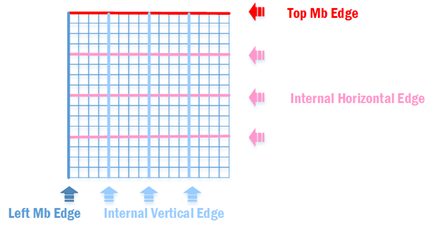
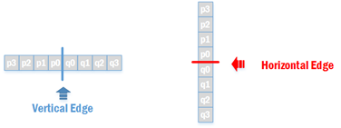
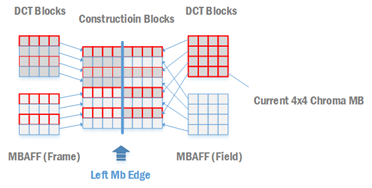
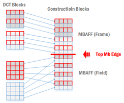
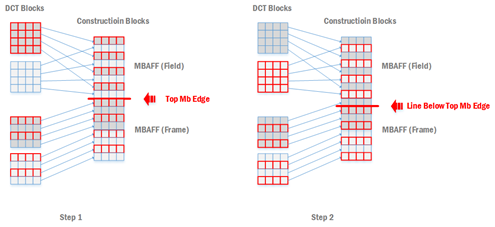
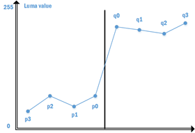
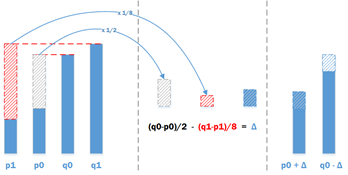
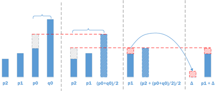

# 块效应及其产生原因
我们在观看视频的时候，在运动剧烈的场景常能观察到图像出现小方块，小方块在边界处呈现不连续的效果（如下图），这种现象被称为块效应（blocking artifact）。

首先我们需要搞清楚块效应产生的原因。h.264在编码过程中对像素残差进行了DCT变换，变换后得到的DCT系数是与每个像素都相关的，这些系数代表了被变换数据的基础色调与细节。h.264在DCT变换后对DCT系数进行了量化，量化能有效去除相邻像素间的空间冗余，也就是说会抹去元素数据的部分细节。比较理想的情况是量化抹去人眼无法识别的细节部分，但是在低码率的情况下就会导致原始数据的细节丢失过多。而且，DCT变换时基于块的，即将8x8或者4x4的像素残差进行变换后得到8x8或者4x4DCT系数，此时如果进行了低码率的量化，就会使得相邻两个块的相关性变差，从而出现块效应。
h.264的运动补偿加剧了由变换量化导致的块效应。由于运动补偿块的匹配不可能绝对准确，各个块的残差大小程度存在差异，尤其是当相邻两个块所用参考帧不同、运动矢量或参考块的差距过大时，块边界上产生的数据不连续就更加明显。
块效应主要有两种形式：一种是由于DCT高频系数被量化为0，使得强边缘在跨边界处出现锯齿状，称为梯形噪声；另一种经常出现在平坦区域，由于量化导致本来平缓变换的亮度块DC系数发生跳跃，造成变换块的基础色调改变，这种称为格形噪声。

# 去块滤波在编解码器中的位置
为了减轻和消除视频图像中的块效应，通常会使用滤波器对块边界处的像素进行滤波以平滑像素值的突变，这种滤波被称为去块滤波器（Deblocking Filter）。
标准8.7小节中规定了去块滤波的内容，这部分被称为环路滤波器（loop filter）。环路滤波器是被放置在编解码的图像重建环路当中。在启用了环路滤波的编解码环境中，无论是编码器还是解码器，都是在图像被重建后才进行滤波。在编码器中，滤波后的图像会作为后续编码运动补偿的参考图像；在解码器中，滤波后的图像会被输出显示并且作为后续图像解码重建的参考图像。

# 滤波前的准备

#### 1. 滤波参数
在标准中，去块滤波会被应用于亮度以及色度宏块的滤波，语法元素disable_deblocking_filter_idc用于控制去块滤波是否打开，它的取值有三个：0~2。

* 0：开启去块滤波功能，去块滤波能穿越slice边界。
* 1：关闭去块滤波功能。
* 2：开启去块滤波功能，但是滤波只能对同一个slice范围内的宏块执行。

#### 2. 滤波边界
去块滤波基于宏块进行，包括亮度宏块以及色度宏块。亮度宏块的宽高为16x16宏块，而色度宏块有几种不同的格式，去块滤波边界如下图：

图中粗线条为滤波边界，其中红色粗线为水平边界（Horizontal edge），蓝色粗线为垂直边界（Vertical edge），滤波边界把宏块分割成多个4x4的块。需要注意的一点是，如果transform_8x8_mode_flag为1，则代表亮度宏块以及4:4:4的色度宏块会采用8x8的DCT，此时亮度宏块以及4:4:4的色度宏块的滤波边界会把宏块分割成8x8的块。
滤波边界还能根据滤波过程是否会用到当前宏块以外宏块来进行细分。宏块的顶部边界、左边界由于处于宏块边缘，滤波的时候肯定需要用到相邻宏块，而其余的滤波边界在滤波时只会用到当前宏块内部的像素。

* **Left MB Edge**: 垂直方向上宏块最左边的宏块滤波边界
  * 如果当前宏块为图像的最左边宏块的话，不需要进行左边界滤波
  * 如果规定了只能用当前slice的宏块进行滤波（disable_deblocking_filter_idc=2），并且当前宏块与其左边宏块不为同一slice，那也不需要进行左边界滤波

* **Vertical Internal Mb Edge**: 垂直方向上的宏块内部滤波边界。不同宏块类型其中包含的垂直内部滤波边界的数量不同

* **Top MB Edge**: 水平方向上宏块最顶部的宏块滤波边界
  * 如果当前宏块为图像的最顶部宏块的话，不需要进行顶部边界滤波
  * 如果规定了只能用当前slice的宏块进行滤波（disable_deblocking_filter_idc=2），并且当前宏块与其上方宏块不为同一slice，那也不需要进行顶部边界滤波

* **Vertical Internal Mb Edge**: 垂直方向上的宏块内部滤波边界。不同宏块类型其中包含的垂直内部滤波边界的数量不同

滤波先进行亮度宏块滤波后进行色度宏块滤波，对一个宏块滤波边界的滤波也需要遵循一定顺序

* 先进行垂直边界滤波，从左到右
* 后进行水平边界滤波，从上到下

#### 3. 滤波源像素选择
去块滤波所用的源像素分布在边界的两边，分别有4个像素点，如下图所示

p与q像素所在的4x4或者8x8块我们分别成之为P块与Q块。
如果当前编码的图像以帧或者场的方式进行编码，则可以直接按照上述边界两边的位置得到滤波的源像素点。不过如果图像采用帧场自适应方式进行编码（MBAFF），则需要对边界两边的像素进行定位以得到正确的源像素。
我们在前面已经讨论过，块效应是由于对块（block）进行DCT变换量化产生的，去块滤波的目的是消除块效应，因此去块滤波需要正确地定位出进行DCT变换量化的块。在帧场自适应的编码环境下，宏块可以以帧或者场的方式进行编码，但是在宏块进行重建后得到的都是帧宏块，因此我们需要根据实际情况定位出当时进行DCT变换量化的块所在的像素。
以下是在帧场自适应编码环境下，一个垂直边界滤波像素定位的事例

以下是在帧场自适应编码环境下，一个水平边界滤波像素定位的事例

另外，在帧场自适应的编码环境下，如果当前宏块为帧宏块，它的上方宏块为场宏块，那么在进行顶部边界滤波时需要进行两条边界的滤波

# 滤波过程

#### 1. 估算边界强度
对于滤波边界，我们首先需要根据边界所在的位置已以及宏块的信息来粗略地估计边界两边的像素差距，我们称这个像素差距为边界强度（BS，Boundary Strength）。

上述表格用于亮度BS的计算，色度宏块的BS沿用其相应亮度宏块的BS。由于表格的描述不尽详细，详情请参考标准8.7.2.1

#### 2. 区分真假边界
在粗略地估算滤波边界强度后，我们需要区分这个边界强度是由于对块进行DCT变换量化引起的块效应（虚假边界）还是视频图像原有的边界（真实边界）。如果是真实边界则不需要进行滤波，如果是虚假边界则需要进行去块滤波。区分真假边界基于下面两个假设：

* 真实边界两边像素点的差值通常比虚假边界两边像素值要大
* 对于两边像素值差别很小的真实边界，即使使用了去块滤波，对它的主观效果不会有太大影响
因此，去块滤波应该遵循以下原则：

* 在平坦区域，即使很小的像素不连续也很容易被人察觉，所以要使用比较强的去块滤波，可以改变较多的像素点
* 对于复杂的区域，为了保持图像细节，要使用较弱的去块滤波，改变较少的像素点

假设下图为像素点的亮度值分布图，这种情况下两边像素点的差值非常大，根据上面的假设，在p0和q0之间出现的是物体的真实边界，因而不需要进行滤波。

标准h.264中设定了两个阈值α和β来判断真假边界，α表示块与块之间的边界阈值，β表示块内部边界的阈值。对于边界两边的像素点的差值，如果下面三个条件都满足就会被判定为需要滤波的虚假边界，否则就判定为不需要滤波真实边界。
|p0 - q0| < α[IndexA]
|p1 - p0| < β[IndexB]
|q1 - q0| < β[IndexB]
其中α与β可以通过IndexA以及IndexB从表格中得到。IndexA以及IndxeB为表格的索引，他们的计算方法如下
IndexA = Clip3( 0, 51, QPaverage+ FilterOffsetA )
IndexB = Clip3( 0, 51, QPaverage+ FilterQffsetB )
其中QPaverage= ( QPp+QPq+1) / 2，FilterOffsetA以及FilterOffsetB则为偏移量，偏移量用于调整滤波强度。当需要增加滤波强度时，用正偏移量，可以去除由次优运动估计、编码模式选择不当引起的块效应，改善图像主观质量；当需要减少滤波强度时，用负的偏移量，可以保护图像细节不被滤波器的平滑作用模糊掉。偏移量将在slice头信息中传输，请参考[h.264语法结构分析](http://www.cnblogs.com/TaigaCon/p/5215448.html)中的deblocking相关语法元素。

由上述式子知道，α与β的取决于QP的大小，IndexA、IndexB与α、β对应值见下表

可见QP越大（Index越大），α与β就越大。QP越大意味着量化误差越大，块效应会越明显，因此阈值也应该取较大值来增大滤波效果，反之阈值应该取较小值。

#### 3. 滤波运算
在前面我们讨论了5种边界强度BS，当边界强度不为0时，就需要进行边界滤波。h.264的边界滤波有两种滤波器

* BS = 1,2,3，采用强度较弱的滤波器，首先改变p0、q0两个像素点，接着用阈值β判断是否需要调整p1和q1
* BS = 4，此时有两种强度的滤波器，强滤波器可以改变6个像素点（p0、p1、p2、q0、q1、q2），弱滤波器只改变边界上的两个点（p0、q0）

##### （1） BS = 1,2,3时的滤波运算
①首先对边界上的两个像素点p0与q0进行滤波，它需要输入p1、p0、q0、q1，滤波过程如下

1. 先要得到差值Δ，差值的计算方式：Δ = ( (q0-p0)<<2 + (p1-q1) + 4 ) >> 3
2. 然后需要对差值Δ进行限幅，保证这个差值在一定的范围内，这个范围主要通过查表得到，详情请查看标准8.7.2.3
3. 用差值Δ来计算新的p0、q0，也就是滤波后的值

②接下来对块内的像素点p1与q1分别进行滤波。4:2:0以及4:2:2色度宏块边界的话是不需要执行这部分的滤波的。如果是要计算p1，则需要输入p2、p1、p0、q0；如果是q1，则需要输入p0、q0、q1、q2。
另外，只有满足|p2-p0|<β才能对p1进行滤波，因为满足这个条件则认为P块内部p1处有虚假边界，p1的滤波过程如下

1. 先要得到差值Δ，差值的计算方式为：Δ = ( p2 + ((p0+q0+1)>>1) − (p1<<1)) >> 1
2. 然后需要对差值Δ进行限幅，保证这个差值在一定范围内，这个范围主要通过查表得到，详情请查看标准8.7.2.3
3. 用差值来计算新的p1
q1的滤波过程也是类似的步骤。

##### （2） BS = 4时的滤波运算
在h.264的帧内预测编码中，倾向于对纹理简单的区域用16x16亮度预测模式编码（如蓝天、白色墙面等），以达到快速编码的目的。虽然这种方法只会在宏块边界引起轻微的块效应，但是在这种情况下，即使很小的强度值查表也会在视觉上产生陡峭的阶梯状的感觉（色块分层），因而对于这种内容平滑的宏块边界就需要采用较强的滤波器；如果此时宏块边界有大量的细节存在，反而不应做强滤波。对此h.264仍采用阈值法来判断是否存在真实边界，如果不存在大量细节信息，可以做强滤波，反之做弱滤波。
这里的滤波是比较好理解的抽头滤波器，P、Q块上的滤波过程差不多，这里以P块为例。
对于P块的点，如果满足下式，则认为细节信息不多：
$\left\{\begin{matrix}
|p0-q0|&<&(\alpha >> 2)+2\\
|p2-p0|&<&\beta
\end{matrix}\right.$
采用强滤波
$\left\{\begin{matrix}
p0 &= &(p2+2p1+2p0+2q0+q1+4)>>3\\
p1 &= &(p2+p1+p0+q0+2)>>2 \\
p2 &= &(2p3+3p2+p1+p0+q0+4)>>3
\end{matrix}\right.$
否则采用弱滤波，只改变p0点
$p0 = (2p1+p0+q1+2)>>2$

**参考文献**
ITU-T Rec. H.264 (04-2013) Advanced video coding for generic audiovisual services
陈靖、刘京、曹喜信：深入理解视频编解码技术——基于H.264标准及参考模型

