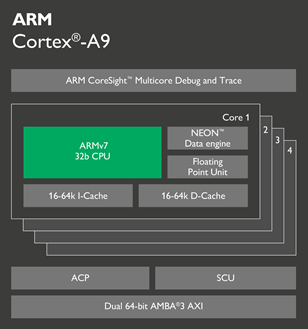
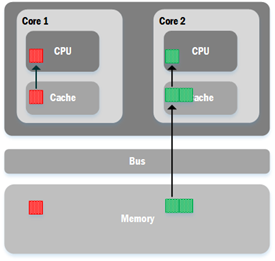
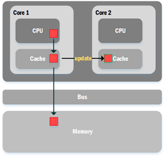
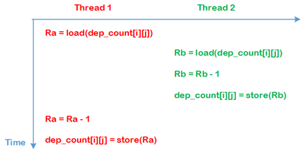

# cache-coherent shared-memory system
我们最平常使用的很多x86、arm芯片都属于多核共享内存系统，这种系统表现为多个核心能直接对同一内存进行读写访问。尽管内存的存取速度已经非常快，但是仍然不足以与CPU的处理速度相比，因此为了提高CPU的利用率，一般会在芯片的每个核心内提供cache。cache像内存一样用于数据的存取，虽然它的大小有限，但速度比内存更快，接近于CPU的速度，因此它会充当CPU与内存的中间站角色，用于缓冲数据。

每当CPU要从内存读取数据来处理的时候，会先查看cache内是否存在该数据，存在的话就直接从cache中读取，否则会从内存中读取该数据，同时也会连同所需数据的周边数据一起读到cache中；而当CPU在处理完成并且把数据写回内存时，会先把数据写回cache，由于此时其他核心也有可能存在该数据的副本，因此会令其他核心的cache中的数据副本无效并且更新成新的数据副本，这种cache写回策略被成为[cache coherence](http://wenku.baidu.com/link?url=kcbOUGQZPfTpv7s4Ru4eGyN7uVyQ1ncXZmPrImcGyTlzLIVqHsAHpfnZ9mK8oJefByfaFZ6A4-TBwqHdqvItCDf574kqqMniCrCm7LzalfW)。

在这种系统中，如果CPU是处理的是一系列连续的数据，那么cache中预先读取的相邻数据将会很好地被派上用场，从而减少了CPU向内存读取数据的次数，因此能提高CPU的数据处理效率。

# 2D-Wave实现
在多核共享内存系统中，这里的2D-Wave算法实现类似于前一篇文章描述的Task Pool，但其中一个明显的差异就是在共享内存系统中不需要一个主核心来管理任务池，因为任务池是存放在共享内存中的，它能被所有核心访问。核心P需要调用tp_submit(fun_ptr, <param>)来把任务提交到任务池。其中参数fun_ptr就是待执行的函数（任务），参数<param>是传给该函数的相关参数。类比到我们日常使用的函数就是pthread_create。

#### 原子操作
既然涉及到了共享内存的多任务处理，不得不说的就是原子操作。如TP中的宏块依赖表，它位于共享内存中也就意味着它能被各个任务（核心）访问，如果不对这种访问进行原子操作，就有可能导致程序执行发生错误。
有宏块MB(i, j)，它在宏块依赖表里面的依赖计数为dep_count[i][j]，初始状态为dep_count[i][j]=2。
线程1为MB(i, j)的右上方宏块的解码线程，当宏块解码完毕后需要对dep_count[i][j]进行减一操作。
线程2为MB(i, j)的左方宏块的解码线程，当宏块解码完毕后需要对dep_count[i][j]进行减一操作。

对dep_count[i][j]的减一操作在汇编上可以被分解为以下几步：

1. 把dep_count[i][j]的值从内存中读取出来，存放到寄存器R，记为R = load(dep_count[i][j])
2. 减法操作，R = R – 1
3. 把寄存器R内的数值写回到内存dep_count[i][j]，记为dep_count[i][j] = stroe(R)
由于对内存上的数值进行减一操作可以被分为三步指令，因此在多任务系统中可能会出现下面的情况

最终结果是，虽然MB(i, j)的两个依赖都被解码完成，但由于它的依赖计数dep_count[i][j]不为零，那么程序会认为该宏块的依赖没有解码完成，也就不会开始解码MB(i, j)。为了避免出现这种情况，我们就有必要对这一减法运算加上原子操作，该原子操作用atomic_dec来标记。得到的伪代码如下
/*注意，此处x代表纵轴，y代表横轴*/
void decode_mb(int x, int y)
{
    /* ... the actural work (实际的解码操作) */

    /* check and submit right MB (如果右宏块准备就绪则提交解码任务) */
    if (y < WIDTH-1)
    {
        atomic_dec(dep_count[x][y+1]);
        if (dep_count[x][y+1] == 0)
        {
            tp_submit(decode_mb, x, y+1);
        }
    }

    /* check and submit down-left MB (如果左下宏块准备就绪则提交解码任务) */
    if (x < HEIGHT-1 && y != 0)
    {
        atomic_dec(dep_count[x+1][y-1]);
        if (dep_count[x+1][y-1] == 0)
        {
            tp_submit(decode_mb, x+1, y-1);
        }
    }
}

#### 优化
前面讲了，在含有cache的多核共享内存系统中，从内存读取数据进入核心处理时会顺带预读取所需数据的相邻部分进入cache，以此来加快数据的处理速度。按照cache系统的这种特性，如果cache预读的数据量（cache line）大于宏块的宽度（16 pixel）的话，那么在核心读取一个宏块的像素数据进行处理时，它的相邻宏块也被预读取进入了cache，此时，如果该核心在下一次解码任务中需要解码的恰好是这个被预读了的相邻宏块，将会省去从内存中读取像素数据这一步骤，从而提高解码效率。因此优化的方向就是在Task Pool方案的基础上使得核心尽可能地去解码相邻宏块。
按照上面的思路，下面展示一种叫做tail submit的优化方案
/*注意，此处x代表纵轴，y代表横轴*/
void decode_mb(int x, int y)
{
    down_left_avail = 0;
    right_avail = 0;
    do {
        /* ... the actural work (实际的解码作业) */

        if (x < HEIGHT-1 && y != 0)
        {
            atomic_dec(dep_count[x+1][y-1]);
            if (dep_count[x+1][y-1] == 0)
                down_left_avail = 1;
        }
        if (y < WIDTH-1)
        {
            atomic_dec(dep_count[x][y+1]);
            if (dep_count[x][y+1] == 0)
                right_avail = 1;
        }

        /* give priority to right MB */
        /* 当前线程优先解码右宏块 */
        if (down_left_avail && right_avail)
        {
            /* 提交左下宏块给其他线程解码，自己解码右宏块 */
            tp_submit(decode_mb, x+1, y-1);
            y++;
        }
        else if (down_left_avail)
        {
            x++; y--;
        }
        else if (right_avail)
        {
            y++;
        }
    }while (down_left_avail || right_avail);
}
如上述伪代码所示，在解码任务decode_mb中添加了循环，每次循环后都会判断当前宏块的右宏块以及左下宏块是否准备就绪，从而去解码它们。这一循环使得一个核心在执行解码任务时，能更连续地解码宏块，而不是每解码完一个宏块就把下一个宏块的解码交给其他线程，这样能够节省tp_submit的开销。另外，如果相关宏块准备就绪的话，从代码中可以看到一个宏块解码完成后，会在下一个循环中更优先解码它的右宏块，这就达到了优化的目的。

关于h.264并行解码算法的更详细分析请参考Ben Juurlink · Mauricio Alvarez-Mesa · Chi Ching Chi · Arnaldo Azevedo · Cor Meenderinck · Alex Ramirez:《Scalable Parallel Programming Applied to H.264/AVC Decoding》

