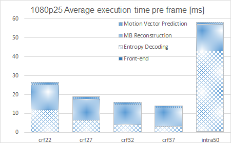
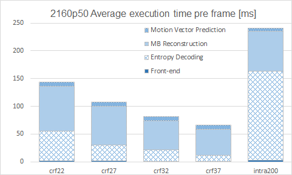
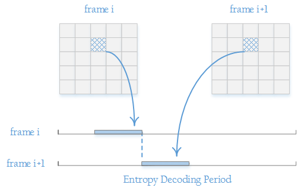
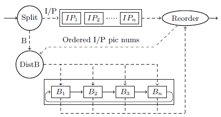

在前面讨论并行解码的章节中，我们专注于讨论解码的宏块重建部分，甚至把宏块重建描述成宏块解码，这是因为在解码工作中，宏块重建确实占了相当大的比重，不过解码还包含其它的部分，按照解码流程可粗略分为：

1. 读取并初步解析码流（front-end）
2. 熵解码（本文章只讨论CABAC）
3. 帧间预测、帧内预测 （主要讨论部分为运动向量预测）
4. 宏块重建

在以前的并行解码文章，我们主要讨论了宏块重建的并行算法，得知采用不同的算法，会产生不同的并行度。在不考虑硬件负担的情况下，并行度可以达到几十，甚至上千，如此一来，除开宏块重建的其它解码模块就很有可能成为解码的瓶颈。因此，获得各解码流程在解码中所占的比例，并提高瓶颈部分的执行效率是接下来需要解决的重点问题。

# 阿姆达尔定律（Amdahl's law）
在进行实际的工作之前，先来分析一下瓶颈对于并行系统性能的影响。阿姆达尔定律能充分阐述这一影响的。
阿姆达尔定律声明了一个并行处理系统，系统的流程包含了非并行部分，所占比例为整个系统的s，系统的流程中的可并行部分所占比例为整个系统的1-s，p为该并行系统的核心数，那么这个并行系统有最大性能提升为
$ S_{max} = \frac{1}{s+\frac{1-s}{p}} $
原本在单位时间1可以完成1项作业，在经过并行处理后最高可以完成$S_{max}$项作业

不过由于系统中存在不可并行部分s，所以即使$p \to \infty $，最大性能$S_{max}$也只能到$\frac{1}{s}$，s就是该系统的瓶颈。为了更显著提高系统性能，需要想办法提高s部分的效率。
以解码系统来说，假设宏块重建部分占比为80%，核心数为16，那么解码系统并行解码的性能为
$S_{max} = \frac{1}{0.2+\frac{0.8}{16}} = 4$
并行度只有4，最大也不超过5，与核心数有明显的偏差。因此提升解码其它部分的效率就显得非常重要。

# 各解码模块在串行解码流程中的占比
占比，即各模块运行所用时间占总体解码时间的比例。在串行（顺序）解码器中，时间能代表某一模块占用cpu资源的多少，这恰恰是我们最关心的。

#### 串行解码准备
为了获得各模块的时间占比，首先需要一个串行解码器，本文采用ffmpeg。然后在解码器的四个模块的起止处记录时间，所采集到的时间在解码结束后会被用于统计得出各模块在解码过程中的平均时间占比。
接下来是选取要解码的h.264码流。为了使得出来的结论更具有一般性，所选取的码流必须多种多样。例如不同画面变化程度的码流、不同分辨率的码流、不同压缩质量的码流，在实验中为了做到变量的可控，一般会选取不同的视频序列用x264进行压缩从而得到所需码流。《Scalable Parallel Programming Applied to H.264/AVC Decoding》一书中选取了以下条件的码流进行测试。

第一组为1080p分辨率的三个视频序列的组合，第二组为2160p分辨率的两个视频序列的组合，把画面变化不同的视频序列组合到一起，在某种程度上能体现出视频场景的一般性。
这两个组合后的视频序列会分别用x264进行编码，得到我们所需的码流。编码时采用CRF（Constant Rate Factor）来对码流质量进行控制，数字越小代表质量越高，因此编码后得到的码率也会越高。另外，在只采用intra模式进行编码的情况下，码流的码率是其中最高的，1080p25就高达50Mbps。

#### 统计串行解码结果
对上述码流用ffmpeg进行解码后统计出来的结果如下图

从图中能总结出以下结论

1. CABAC解码、宏块重建、运动向量预测平均消耗了总解码时间的99.5%
2. CABAC解码时间占比受编码选项的影响很大，占比从crf37的20%到intra-only的72%不等，平均值为37.6%
3. 各解码模块的解码时间占比不是固定的，编码选项是影响各模块时间占比的主要原因
需要注意的一点是，这里的解码采用的ffmpeg的宏块重建模块是经过了SIMD指令优化的，而熵解码（CABAC）模块没有能有效进行SIMD指令优化的数据。
在获得平均熵解码耗时占比后，就能通过对阿姆达尔定律稍作修改，得到性能提升的目标值。
$S_{max} = \frac{1}{\frac{s}{f}+\frac{1-s}{p}}$
其中，$S_{max}$为性能提升的目标倍数，s为熵解码的耗时占比，1-s为宏块重建耗时占比（Front End由于占比太小忽略不计，运动向量预测占比也比较小，而且后面会讨论到该模块合并到熵解码或者宏块重建模块中，因此在此忽略），f为熵解码加速倍率，p为并行核心数。
前面已得到熵解码的平均耗时占比为37.6%，这里取值s=0.38。不过需要注意，如果熵解码是采用硬件进行性能提升的化，取平均值并不合适，而是应该考虑最坏的情况。假设为64核系统，那么按照《Scalable…》书中关于3D-Wave算法中的讨论，宏块重建达到的性能提升倍率为50，我们这里的目标是达到其80%，即
$0.8 \times 50 = \frac{1}{\frac{0.38}{f} + \frac{0.62}{64} }$
得到f = 24.8，也就是说，熵解码要提升到24.8倍的速度，但是目前来说即使用硬件来实现CABAC解码模块也无法达到这个目标，因此我们需要考虑并行实现。

# 并行CABAC熵解码

#### 数据分割
我们以前分析过[CABAC](http://www.cnblogs.com/TaigaCon/p/5304563.html)，它是以slice为一个编码周期，在同一周期内，编码过程具有极高的相关性，因此是无法在slice以下级别进行并行的。不过，在slice与frame级别中可以很轻松地进行数据分割，分割得到的是互不相干的数据，然后即可进行并行熵解码。
在讨论h.264语法结构的时候，我们知道h.264规定了帧的起始标记为0x00000001，slice的起始标记为0x000001。那么在把码流从磁盘读取进内存时，如果发现起始标记，即可把接下来的码流分配给熵编码线程进行解码，直到碰到下一个起始标记，再把接下来的码流分配各另一个熵解码线程，如此一来就可以实现并行熵解码。

#### 假依赖（false dependency）
一般来说，并行系统的设计是在原有的串行系统（legacy code）的基础上修改而来的，也就是说需要把上述的这种并行方法集成到现有的串行h.264解码器上，如ffmpeg。ffmpeg是经过良好优化的解码器，它为了提高cache的命中率，把运动向量部分包含在CABAC解码模块内，如此一来宏块在熵解码完成后就能立即进行预测，不必重复加载宏块信息，因此能提升解码效率。不过这种做法在并行熵解码上会带来一些问题。
运动向量预测当中有一种预测模式称为[B帧直接预测](http://www.cnblogs.com/TaigaCon/p/3677540.html)（B Direct），这种模式只存在于B帧当中。采用了这种模式的宏块在码流中并没有自己的运动向量，而是重用了最近参考帧的co-locate宏块的运动向量，这是一种属于运动向量预测模块的依赖。在编码运动较单一的视频中，这种模式能有效提高压缩率。而在解码端，由于ffmpeg中的运动向量预测与CABAC熵解码耦合度很高，那么在并行化的过程中就会引入了原本不属于CABAC的依赖，这被称为假依赖（Therefore, from the point of view of CABAC stage, this dependency is a false dependency and is due to legacy code）。
这种假依赖意味着CABAC线程在解码B Direct宏块时就必须先阻塞，等待co-locate所在宏块解码完成才能继续解码。如果我们没有相应的对策，线程就有可能因为这种假依赖的引入的阻塞影响到解码效率。

#### 优化假依赖的策略
针对这种会影响到并行解码效率的情况，有以下几种对策

* 用熵解码宏块进度表来控制熵解码顺序，保证当前帧的熵解码永远比前一帧慢至少一个宏块。以下是一个称为Entropy Ring (ER)的策略，该策略主要包含两类线程：一个Dist线程用于分发熵解码任务，n个Entropy Decoding Threads (EDT)用于进行熵解码。策略规定了每个EDT解码固定的某帧，即EDTi解码frame i+n, i+2n……，形成解码环，因此称为Ring。EDTi在解码完成一个宏块后需要更新宏块进度表，而EDTi+1需要根据这个表了决定是否开始进行下一个宏块的熵解码。

宏块进度表

***宏块进度表用于记录线程的熵解码进度，单位为宏块。**

* B-Ring。这一策略是ER的改进版本。在一般的视频中，B帧占绝大多数，熵解码时间较短，而I、P帧占比例小，熵解码时间较长，并且I、P帧中由于不含有B Direct模式，因此可以随意进行熵解码而不用担心假依赖问题。出于负载均衡的考虑，熵解码线程应该分成两大组，一是解码I、P帧的线程组IP，另一组是解码B帧的线程组B。B帧仍需要按照ER那样进行Ring分配，IP则由于不存在假依赖关系，因此不用遵循特定解码顺序。

宏块进度表

上述两种策略更详细请参考[A QHD-Capable Parallel H.264 Decoder](https://pdfs.semanticscholar.org/6b43/d72c087c15c93d5c76262e05b66b857c258e.pdf)

* 将运动向量预测部分从CABAC解码分离出来，合并到宏块重建部分。B Direct所引入的依赖是最近参考帧上与当前宏块相同位置上的宏块，也就是帧间依赖。在static 3D-Wave算法中，该依赖是涵盖在了宏块重建的帧间依赖范围内的，而在Dynamic 3D-Wave中，我们可以在宏块重建开始前把该依赖添加到帧间依赖表中去。当然，分离耦合度很高的两部分需要对legacy code有足够的理解，作业的工程量并不小。另外，这么做破坏了legacy code原本的提升代码命中率的目的，因此在串行解码的时候效率会比原来有所降低。

#### 熵解码与宏块重建的解耦
熵解码与宏块重建分别作为独立的大模块进行并行解码，两个模块之间必然会有大量数据往来，其中最显著的数据的就是语法元素（syntax element）。熵解码得到的语法元素会作为宏块重建的原料。为了维持双方的高并行，中间需要大量的内存空间来缓存语法元素。

# 实验与结论
如前文所述，书中采用的是基于ffmpeg修改的并行解码器，这里为了单独测试熵解码的并行解码性能停用了宏块重建模块，具体实验设置与结果可以移步书中去查看。这里扯一下结论：串行时CABAC熵解码所用的时间越长，高并行时性能提升越明显。

如上图的例子是1080p25的结果，intra only在40核并行时仍然能保持35以上的倍率；crf27在40核并行时只有21的倍率；crf32在40核并行时更是只有15的倍率。这其实是内存带宽造成的影响，由于内存带宽的限制导致倍率不再提升。
我们回顾串行解码时的数据，可以得到串行解码不同配置的码流的平均熵解码时间，在此次实验中可以得到并行熵解码不同配置的码流的平均熵解码时间，对比得到如下表格。

***上述数据为按图目测，不尽精确**
熵解码吞吐的数据中包含有输入的码流以及解码后的语法元素，而码流毕竟是经过压缩的数据，相比语法元素所占用的内存会小很多，因此我们可以将内存吞吐的数据看作约一帧的语法元素。我们对比的是同一视频序列，尽管该视频序列以不同的配置进行压缩得到不同码流，但是码流在解码后得到的语法元素就是内存中的某个变量，变量都是有固定格式、固定大小的。因此可以认为不同码流的语法元素占用内存大小的区别不是很大。也就是说，可以粗略认为intra only用1.2ms吞吐了一帧语法元素，此时并没有达到内存带宽瓶颈，而crf32用0.27m吞吐一帧语法元素，此时已经达到了内存带宽的瓶颈。
***上述结论建立在假设系统的磁盘与内存之间存在出色的缓存机制，我们只需关注内存与cpu间的数据传输问题**

