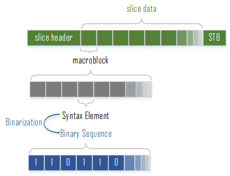
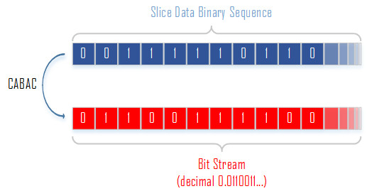
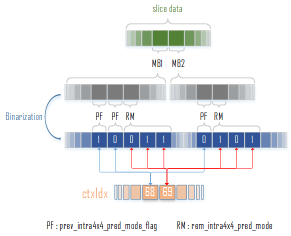
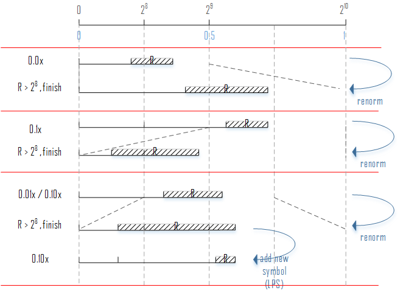
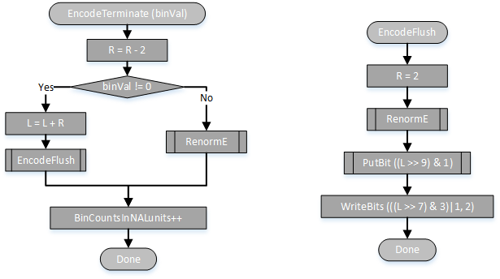
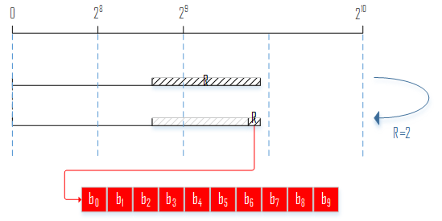
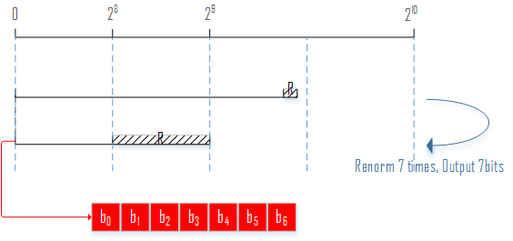
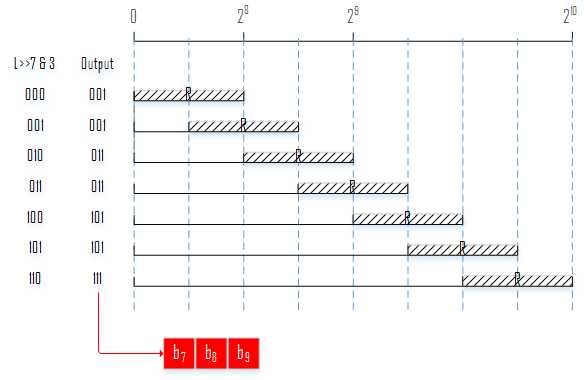

在之前的一篇文章[CABAC](http://www.cnblogs.com/TaigaCon/p/5304563.html)中我们已经对算法中的大部分细节部分做了详细分析，这里做一个总结与拾遗。

# 总结
CABAC的编码可以分为以下四个部分：

* 上下文变量的初始化
* 待编码语法元素二值化
* 上下文建模（确定上下文索引）
* 算术编码
本文的主要目的就是阐明CABAC是如何把这四个部分串联起来的。

在编码一个slice的slice data之前，需要根据该slice的sliceQP对上下文变量进行初始化。
CABAC编码的是语法元素中slice data部分，也就是一个码流中的主体部分。在[h.264语法结构](http://www.cnblogs.com/TaigaCon/p/5215448.html)当中，我们已得知一个slice是由slice头部、数据、尾部组成的。那么在进行CABAC编码时，slice data中的所有语法元素全部都会被进行二值化处理，得到二进制串，这些二进制串就是进行二进制算术编码的原料。

二进制算术编码会对该slice data中的所有语法元素的二进制串的每一个bit进行编码，按照算术编码的原理，编码得到的结果是一个小数，而该小数就代表了码流中的slice data的数据。

由于CABAC是自适应编码，也就是概率会随着0、1的出现而调整。具体来说，语法元素在二值化转换成二进制串后，一个位置的bit为0或者1将会影响之后该位置出现的0、1的概率。

如上图，第一个prev_intra4x4_pred_mode_flag的bit为1，这将影响ctxIdx=68的上下文（概率），在编码下一个prev_intra4x4_pred_mode_flag时的将会采用已被改变的ctxIdx=68的上下文；rem_intra4x4_pred_mode的三个bit共用一个ctxIdx=69的上下文，这表明在该语法元素的第一个bit将会影响其后面的bit的概率。

# CABAC的算术编码补充讨论

#### 重归一化
我们在之前的文章中讨论过CABAC在算术编码一个符号之后是如何输出其编码结果的，如下图。

这张图能很好地概括重归一化流程，不过仅仅执行重归一化流程并不能得到算术编码的结果。以上述的0.0x为例，算术编码的结果应该是得到一个位于区间R内的小数，而上述流程仅会输出”.0”，这显然还不是最终结果。
**如果把最终结果的小数分为已确定部分与未确定部分，那么重归一化之后输出的就是已确定部分**。举个例子来说就是：如果确定了R处于区间[0.010,0.011)，那么0.01就是已确定部分，后来输入的符号无法修改到这部分。随着编码更多的符号，输出的bit会增多，也就是已确定部分会越来越多，越来越接近算术编码的最终结果。那么在编码完最后一个符号之后，执行重归一化，剩下的未确定部分该怎么确定？

#### EncodeFlush
剩下的未确定部分由EncodeFlush来确定。EncodeFlush有如下流程：

当编码mb_type的binIdx=1的bin或者end_of_slice_flag时ctxIdx = 276，此时会调用EncodeTerminate。如果mb_type的binIdx=1的bin为1，表明此时mb_type=I_PCM;如果end_of_slice_flag=1，表明此时处于slice的末尾。这两种情况下会进入Yes分支，并且进入EncodeFlush。
首先更新L：
$L = L + R$
此时$R=2$，只有$L$或者$L+1$是在区间$R$之内，也就是说只要把这两个值的其中一个写入码流内即可得到最终结果。最终的这次编码需要输出十个bit。

不过我们按照标准中的流程来分析，在选取$R=2$以及更新$L$后，执行了重归一化。重归一化使得$R = R<<7 = 2^8$。按照重归一化的流程，每次对$R$进行左移都会确定一个bit的输出，$R$左移了7次，因此输出了7个bit，剩下3个bit。

随着$R$的左移，$L$也左移了7次：$L << 7 $，只是$L$在重归一化过程中可能会进行$-2^8$或$-2^9$的操作。这意味着在重归一化之后，$L$肯定落在$2^7$的倍数点上。

按照EncodeFlush的流程，剩下的三个bit输出如上图。EncodeFlush首先调用PutBit输出第一个bit，PutBit可以把之前的累积的bitsOutStanding进行输出。然后调用WriteBits输出第二、三个bit。WriteBits会把第三个bit固定写1，在编码end_of_slice_flag时，该bit会被当作rbsp_stop_one_bit，关于rbsp_stop_one_bit请查看[h.264语法结构分析](http://www.cnblogs.com/TaigaCon/p/5215448.html)。

